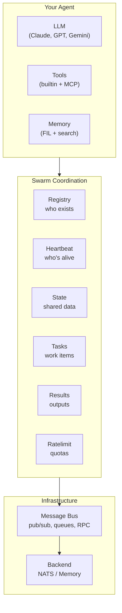

# AgentKit

Reusable Go packages for building AI agent swarms.

## Quick Start

Get an agent running in 5 minutes:

```bash
go get github.com/vinayprograms/agentkit
```

```go
package main

import (
    "context"
    "log"
    "time"

    "github.com/vinayprograms/agentkit/bus"
    "github.com/vinayprograms/agentkit/heartbeat"
    "github.com/vinayprograms/agentkit/registry"
)

func main() {
    ctx := context.Background()

    // Connect to message bus — the backbone of agent communication
    msgBus, _ := bus.NewNATSBus(bus.NATSConfig{URL: "nats://localhost:4222"})
    defer msgBus.Close()

    // Register this agent — so other agents can discover us
    reg, _ := registry.NewNATSRegistry(msgBus.Conn(), registry.NATSRegistryConfig{
        BucketName: "my-swarm",
        TTL:        30 * time.Second,
    })
    defer reg.Close()

    agentID := "worker-1"
    reg.Register(registry.AgentInfo{
        ID:           agentID,
        Name:         "Example Worker",
        Capabilities: []string{"process-tasks"},
        Status:       registry.StatusIdle,
    })

    // Start heartbeat — proves we're alive to coordinators
    sender, _ := heartbeat.NewBusSender(heartbeat.SenderConfig{
        Bus:      msgBus,
        AgentID:  agentID,
        Interval: 5 * time.Second,
    })
    sender.Start(ctx)
    defer sender.Stop()

    // Subscribe to work via queue group — load balanced across workers
    sub, _ := msgBus.QueueSubscribe("tasks.process", "workers")

    log.Printf("Agent %s ready", agentID)

    for msg := range sub.Messages() {
        sender.SetStatus("busy")
        log.Printf("Processing: %s", msg.Data)
        // ... your logic here ...
        sender.SetStatus("idle")
    }
}
```

## Architecture



**Message Bus** is the foundation — all agent communication flows through it.

**Swarm Coordination** builds on the bus — registry tracks agents, heartbeat detects failures, state shares data, tasks manage work.

**Your Agent** uses coordination primitives plus LLM/tools/memory for actual work.

## Learning Path

Start with the fundamentals, then add capabilities as needed:

### 1. Core (Read First)

| Package | What It Does | Doc |
|---------|--------------|-----|
| **llm** | Call LLMs (Claude, GPT, Gemini) with unified interface | [llm-design.md](docs/llm-design.md) |
| **bus** | Message passing between agents (pub/sub, queues, RPC) | [bus-design.md](docs/bus-design.md) |
| **errors** | Structured errors with retry semantics | [errors-design.md](docs/errors-design.md) |

### 2. Swarm Basics (Multi-Agent)

| Package | What It Does | Doc |
|---------|--------------|-----|
| **registry** | Agent registration and capability-based discovery | [registry-design.md](docs/registry-design.md) |
| **heartbeat** | Detect dead agents, trigger failover | [heartbeat-design.md](docs/heartbeat-design.md) |
| **state** | Shared key-value store with distributed locks | [state-design.md](docs/state-design.md) |

### 3. Task Coordination

| Package | What It Does | Doc |
|---------|--------------|-----|
| **tasks** | Idempotent task handling with deduplication | [tasks-design.md](docs/tasks-design.md) |
| **results** | Publish/subscribe for task results | [results-design.md](docs/results-design.md) |
| **ratelimit** | Coordinate rate limits across swarm | [ratelimit-design.md](docs/ratelimit-design.md) |

### 4. Operations

| Package | What It Does | Doc |
|---------|--------------|-----|
| **shutdown** | Graceful shutdown with phases | [shutdown-design.md](docs/shutdown-design.md) |
| **logging** | Structured real-time logging | [logging-design.md](docs/logging-design.md) |
| **telemetry** | OpenTelemetry tracing | [telemetry-design.md](docs/telemetry-design.md) |

### 5. Specialized

| Package | What It Does | Doc |
|---------|--------------|-----|
| **transport** | JSON-RPC transports (stdio, WebSocket, SSE) | [transport-design.md](docs/transport-design.md) |
| **mcp** | Connect to external tool servers | [mcp-design.md](docs/mcp-design.md) |
| **acp** | Editor integration (VS Code, Cursor) | [acp-design.md](docs/acp-design.md) |
| **memory** | Semantic memory with BM25 search | [memory-design.md](docs/memory-design.md) |

## Examples

Working code you can run:

| Example | What It Shows |
|---------|---------------|
| [chat-transport](examples/chat-transport/) | Basic transport setup |
| [task-queue](examples/task-queue/) | Work distribution via bus |
| [swarm-heartbeat](examples/swarm-heartbeat/) | Agent liveness detection |
| [graceful-shutdown](examples/graceful-shutdown/) | Multi-phase shutdown |
| [idempotent-tasks](examples/idempotent-tasks/) | Safe task retries |
| [rate-limiting](examples/rate-limiting/) | Coordinated rate limits |
| [result-publication](examples/result-publication/) | Pub/sub for results |
| [structured-errors](examples/structured-errors/) | Error handling patterns |

## Design Philosophy

- **Composition over frameworks** — Use what you need, ignore the rest
- **Backend agnostic** — Memory implementations for testing, NATS for production
- **Go idiomatic** — Channels, interfaces, context propagation
- **Explicit over magic** — No hidden state, no auto-discovery

## Used By

- [headless-agent](https://github.com/vinayprograms/agent) — Goal-oriented headless agent

## License

Apache-2.0
