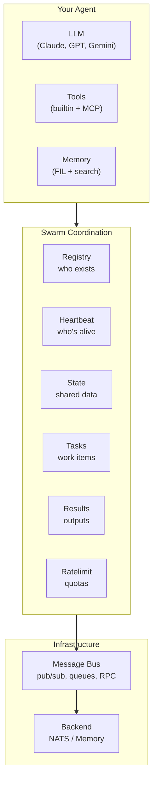

# AgentKit

A Go toolkit for building AI agents. No opinions about agent architecture -- just building blocks: LLM providers, tool execution, memory, message passing, and coordination primitives. Use what you need, ignore the rest.

## Quick Start

```bash
go get github.com/vinayprograms/agentkit
```

The simplest agent: create an LLM provider, define tools, and run an agentic loop.

```go
package main

import (
    "context"
    "fmt"
    "os"
    "time"

    "github.com/vinayprograms/agentkit/llm"
)

func main() {
    // Create an LLM provider (supports Anthropic, OpenAI, Google, Groq, Mistral, Ollama, ...)
    provider, _ := llm.NewProvider(llm.ProviderConfig{
        Provider:  "anthropic",
        Model:     "claude-sonnet-4-20250514",
        APIKey:    os.Getenv("ANTHROPIC_API_KEY"),
        MaxTokens: 4096,
    })

    // Define tools the agent can use
    tools := []llm.ToolDef{{
        Name:        "current_time",
        Description: "Returns the current UTC time.",
        Parameters:  map[string]interface{}{"type": "object", "properties": map[string]interface{}{}},
    }}

    // Agentic loop: send → tool calls → execute → feed back → repeat
    messages := []llm.Message{{Role: "user", Content: "What time is it?"}}

    for {
        resp, _ := provider.Chat(context.Background(), llm.ChatRequest{
            Messages: messages, Tools: tools, MaxTokens: 4096,
        })

        if len(resp.ToolCalls) == 0 {
            fmt.Println(resp.Content) // Final answer
            break
        }

        // Execute tool calls and feed results back
        messages = append(messages, llm.Message{Role: "assistant", Content: resp.Content, ToolCalls: resp.ToolCalls})
        for _, tc := range resp.ToolCalls {
            result := time.Now().UTC().Format(time.RFC3339) // your tool logic here
            messages = append(messages, llm.Message{Role: "tool", Content: result, ToolCallID: tc.ID})
        }
    }
}
```

See [examples/simple-llm-agent](examples/simple-llm-agent/) for the complete, runnable version.

## Architecture


```mermaid
graph TB
    subgraph Agent["Your Agent"]
        LLM["LLM<br/>(Claude, GPT, Gemini)"]
        Tools["Tools<br/>(builtin + MCP)"]
        Memory["Memory<br/>(FIL + search)"]
    end

    subgraph Coordination["Swarm Coordination"]
        Registry["Registry<br/>who exists"]
        Heartbeat["Heartbeat<br/>who's alive"]
        State["State<br/>shared data"]
        Tasks["Tasks<br/>work items"]
        Results["Results<br/>outputs"]
        Ratelimit["Ratelimit<br/>quotas"]
    end

    subgraph Infrastructure["Infrastructure"]
        Bus["Message Bus<br/>pub/sub, queues, RPC"]
        Backend["Backend<br/>NATS / Memory"]
    end

    Agent --> Coordination
    Coordination --> Bus
    Bus --> Backend
```

**Message Bus** is the foundation -- all agent communication flows through it.

**Swarm Coordination** builds on the bus -- registry tracks agents, heartbeat detects failures, state shares data, tasks manage work.

**Your Agent** uses coordination primitives plus LLM/tools/memory for actual work.

## Learning Path

Start with the fundamentals, then add capabilities as needed:

### 1. Core (Read First)

| Package | What It Does | Doc |
|---------|--------------|-----|
| **llm** | Call LLMs (Claude, GPT, Gemini) with unified interface | [llm-design.md](docs/llm-design.md) |
| **bus** | Message passing between agents (pub/sub, queues, RPC) | [bus-design.md](docs/bus-design.md) |
| **errors** | Structured errors with retry semantics | [errors-design.md](docs/errors-design.md) |

### 2. Swarm Basics (Multi-Agent)

| Package | What It Does | Doc |
|---------|--------------|-----|
| **registry** | Agent registration and capability-based discovery | [registry-design.md](docs/registry-design.md) |
| **heartbeat** | Detect dead agents, trigger failover | [heartbeat-design.md](docs/heartbeat-design.md) |
| **state** | Shared key-value store with distributed locks | [state-design.md](docs/state-design.md) |

### 3. Task Coordination

| Package | What It Does | Doc |
|---------|--------------|-----|
| **tasks** | Idempotent task handling with deduplication | [tasks-design.md](docs/tasks-design.md) |
| **results** | Publish/subscribe for task results | [results-design.md](docs/results-design.md) |
| **ratelimit** | Coordinate rate limits across swarm | [ratelimit-design.md](docs/ratelimit-design.md) |

### 4. Operations

| Package | What It Does | Doc |
|---------|--------------|-----|
| **shutdown** | Graceful shutdown with phases | [shutdown-design.md](docs/shutdown-design.md) |
| **logging** | Structured real-time logging | [logging-design.md](docs/logging-design.md) |
| **telemetry** | OpenTelemetry tracing | [telemetry-design.md](docs/telemetry-design.md) |

### 5. Specialized

| Package | What It Does | Doc |
|---------|--------------|-----|
| **transport** | JSON-RPC transports (stdio, WebSocket, SSE) | [transport-design.md](docs/transport-design.md) |
| **mcp** | Connect to external tool servers | [mcp-design.md](docs/mcp-design.md) |
| **acp** | Editor integration (VS Code, Cursor) | [acp-design.md](docs/acp-design.md) |
| **memory** | Semantic memory with BM25 search | [memory-design.md](docs/memory-design.md) |

## Examples

Working code you can run, ordered from simple to advanced:

### Single Agent

| Example | What It Shows |
|---------|---------------|
| [simple-llm-agent](examples/simple-llm-agent/) | LLM provider + custom tools + agentic loop |
| [memory-agent](examples/memory-agent/) | Persistent BM25 memory with remember/recall |
| [structured-errors](examples/structured-errors/) | Error handling patterns |
| [chat-transport](examples/chat-transport/) | Basic transport setup |

### Multi-Agent Coordination

| Example | What It Shows |
|---------|---------------|
| [task-queue](examples/task-queue/) | Work distribution via bus |
| [swarm-heartbeat](examples/swarm-heartbeat/) | Agent liveness detection |
| [idempotent-tasks](examples/idempotent-tasks/) | Safe task retries |
| [result-publication](examples/result-publication/) | Pub/sub for results |
| [rate-limiting](examples/rate-limiting/) | Coordinated rate limits |
| [graceful-shutdown](examples/graceful-shutdown/) | Multi-phase shutdown |

## Design Philosophy

- **Composition over frameworks** -- Use what you need, ignore the rest
- **Backend agnostic** -- Memory implementations for testing, NATS for production
- **Go idiomatic** -- Channels, interfaces, context propagation
- **Explicit over magic** -- No hidden state, no auto-discovery

## License

Apache-2.0
