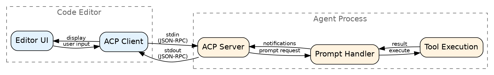
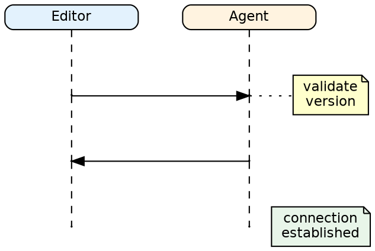
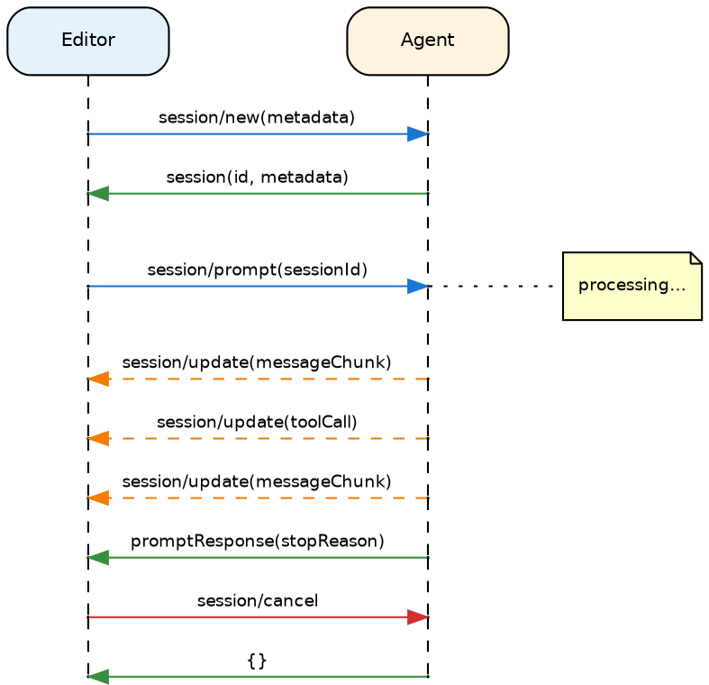

# Agent Client Protocol (ACP) Design

## What This Package Does

The `acp` package implements the Agent Client Protocol — a standard way for code editors to communicate with AI coding agents. It handles the JSON-RPC communication between an editor (VS Code, Cursor, Zed) and your agent over stdio.

## Why It Exists

Code editors want to integrate AI assistants, but each AI has different APIs. ACP provides a common protocol:

- **For editors** — Implement ACP once, work with any compatible agent
- **For agents** — Implement ACP once, work with any compatible editor
- **For users** — Switch agents without switching editors

Without a standard protocol, every editor-agent pair would need custom integration code.

## When to Use It

**Use ACP for:**
- Building agents that integrate with code editors
- Agents that need to receive prompts and send streaming responses
- Agents that use tools and need to report tool calls to the UI

**Don't use ACP for:**
- Non-editor integrations (use `transport` package)
- Agent-to-agent communication (use `bus`)
- Headless agents without user interaction

## Core Concepts

### JSON-RPC Over Stdio

ACP uses JSON-RPC 2.0 over standard input/output. Each message is a line of JSON. The editor sends requests; the agent sends responses and notifications.

This is simple and universal — any language can read/write lines of JSON to stdin/stdout.

### Capabilities

During initialization, the editor and agent exchange capabilities:

- **Agent capabilities** — What features the agent supports (images, audio, session loading)
- **Editor capabilities** — What the editor can display (streaming, tool calls)

This negotiation ensures both sides know what the other supports.

### Sessions

A session represents a conversation context. The editor creates a session, sends prompts, and receives responses. Sessions can have metadata (working directory, open files).

Multiple sessions are possible — each maintains separate state.

### Prompts and Responses

The editor sends a prompt (user message + context). The agent processes it and responds. Responses can be:

- **Synchronous** — Single response with full text
- **Streaming** — Multiple chunks sent as notifications

Streaming is common for LLM-based agents — users see text appear incrementally.

## Architecture

The ACP server handles:
1. Reading JSON-RPC messages from stdin
2. Dispatching to appropriate handlers
3. Sending responses to stdout
4. Emitting notifications for streaming

Your agent implements the handlers; ACP handles the protocol plumbing.

## Protocol Flow

### Initialization

Before any work, the editor and agent exchange capabilities:

1. Editor sends `initialize` with its info and capabilities
2. Agent responds with its info and capabilities
3. Editor sends `initialized` notification
4. Protocol is now ready

### Session Lifecycle

A typical session flow:

1. Editor creates session (`session/new`)
2. Editor sends prompt (`session/prompt`)
3. Agent streams response chunks (notifications)
4. Agent sends tool calls if needed
5. Editor provides tool results
6. Agent completes response
7. Repeat for more prompts

### Cancellation

Either side can cancel an in-progress operation:
- Editor sends cancellation for a pending request
- Agent stops processing and acknowledges

This handles cases like user pressing "Stop" mid-generation.

## Message Types

### Requests (Editor → Agent)

| Method | Purpose |
|--------|---------|
| `initialize` | Start protocol, exchange capabilities |
| `session/new` | Create new conversation session |
| `session/prompt` | Send user message for processing |
| `$/cancelRequest` | Cancel pending operation |

### Responses (Agent → Editor)

Responses match requests by ID. They contain either a result or an error.

### Notifications (Agent → Editor)

| Method | Purpose |
|--------|---------|
| `session/update` | Streaming text chunk |
| `toolCall/start` | Tool execution started |
| `toolCall/result` | Tool execution completed |

Notifications are fire-and-forget — no response expected.

## Error Handling

ACP uses JSON-RPC error codes:

| Code | Meaning |
|------|---------|
| -32700 | Parse error (invalid JSON) |
| -32600 | Invalid request |
| -32601 | Method not found |
| -32602 | Invalid params |
| -32603 | Internal error |

Agent-specific errors use positive codes defined by the application.

## Common Patterns

### Streaming Responses

For LLM-generated text:
1. Receive prompt
2. Start LLM generation
3. As tokens arrive, send `session/update` notifications
4. When complete, send final response

### Tool Calls

When the agent needs to use a tool:
1. Send `toolCall/start` notification
2. Execute tool
3. Send `toolCall/result` notification
4. Continue response generation

The editor can display tool execution to the user.

### Context Embedding

Editors can send embedded context with prompts (file contents, selections). The agent uses this without needing to read the filesystem directly.

## Integration Notes

### With LLM Package

The prompt handler typically calls an LLM. Stream LLM responses back via notifications.

### With Transport Package

ACP is stdio-specific. For other transports (WebSocket, HTTP), use the general `transport` package.

### With Shutdown

Handle `$/exit` or process termination gracefully. Flush any pending state before exiting.

## Design Decisions

### Why stdio?

Editors typically spawn agent processes. Stdio is the simplest IPC — no ports, no sockets, works everywhere.

### Why JSON-RPC?

Standard, simple, well-supported. Easy to debug (human-readable). Line-delimited JSON is trivial to parse.

### Why capability negotiation?

Agents and editors evolve independently. Capabilities let them gracefully degrade when features don't match.

## Testing Strategy

| Level | Focus |
|-------|-------|
| Unit | Message parsing, capability negotiation |
| Protocol | Initialization sequence, session lifecycle |
| Streaming | Notification delivery, chunked responses |
| Errors | Invalid requests, cancellation handling |
| Integration | Full editor-agent round trip |
