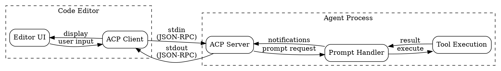

# Agent Client Protocol (ACP) Design

## Overview

The acp package implements the Agent Client Protocol, a JSON-RPC based standard for communication between code editors and AI coding agents. ACP enables editors like VS Code, Cursor, and Zed to integrate with coding agents through a unified protocol over stdio.

## Goals

| Goal | Description |
|------|-------------|
| Editor agnostic | Single protocol works with any ACP-compatible editor |
| JSON-RPC based | Standard protocol with request/response and notifications |
| Streaming support | Real-time message chunks and tool call updates |
| Session management | Multiple conversation contexts with metadata |
| Capability negotiation | Client and agent advertise supported features |

## Non-Goals

| Non-Goal | Reason |
|----------|--------|
| Transport abstraction | ACP uses stdio exclusively |
| Multiple connections | Single client per agent process |
| Binary messages | JSON-only for simplicity and debugging |
| Custom framing | Line-delimited JSON (NDJSON) |

## Architecture



## Core Types

### Server

The `Server` manages the ACP protocol lifecycle over stdio:

```go
type Server struct {
    stdin   io.Reader
    stdout  io.Writer
    scanner *bufio.Scanner
    mu      sync.Mutex
    id      atomic.Int64

    // Handlers
    onPrompt func(ctx context.Context, req *PromptRequest) (*PromptResponse, error)

    // State
    session     *Session
    initialized bool
    info        AgentInfo
    caps        AgentCapabilities
}
```

### AgentInfo

Describes the agent for client display:

```go
type AgentInfo struct {
    Name    string `json:"name"`
    Version string `json:"version"`
}
```

### AgentCapabilities

Advertises agent features during initialization:

```go
type AgentCapabilities struct {
    LoadSession        bool               `json:"loadSession,omitempty"`
    PromptCapabilities PromptCapabilities `json:"promptCapabilities,omitempty"`
}

type PromptCapabilities struct {
    Image           bool `json:"image,omitempty"`
    Audio           bool `json:"audio,omitempty"`
    EmbeddedContext bool `json:"embeddedContext,omitempty"`
}
```

### JSON-RPC Messages

```go
// Request is a JSON-RPC request.
type Request struct {
    JSONRPC string          `json:"jsonrpc"`
    ID      interface{}     `json:"id,omitempty"`
    Method  string          `json:"method"`
    Params  json.RawMessage `json:"params,omitempty"`
}

// Response is a JSON-RPC response.
type Response struct {
    JSONRPC string      `json:"jsonrpc"`
    ID      interface{} `json:"id"`
    Result  interface{} `json:"result,omitempty"`
    Error   *Error      `json:"error,omitempty"`
}

// Notification is a JSON-RPC notification (no response expected).
type Notification struct {
    JSONRPC string      `json:"jsonrpc"`
    Method  string      `json:"method"`
    Params  interface{} `json:"params,omitempty"`
}
```

## Protocol Flow

### Initialization Handshake

```
Editor                              Agent
   │                                   │
   │──initialize(protocolVersion)─────▶│
   │                                   │  validate version
   │◀──agentInfo + capabilities────────│
   │                                   │
   │  (connection established)         │
```

### Session Lifecycle

```
Editor                              Agent
   │                                   │
   │──session/new(metadata)───────────▶│
   │◀──session(id, metadata)───────────│
   │                                   │
   │──session/prompt(sessionId)───────▶│
   │                                   │  processing...
   │◀──session/update(messageChunk)────│
   │◀──session/update(toolCall)────────│
   │◀──session/update(messageChunk)────│
   │◀──promptResponse(stopReason)──────│
   │                                   │
   │──session/cancel───────────────────▶│
   │◀──{}─────────────────────────────│
```

## Protocol Messages

### Initialize

Establishes connection and negotiates capabilities.

**Request:**
```go
type InitializeRequest struct {
    ProtocolVersion string             `json:"protocolVersion"`
    ClientInfo      ClientInfo         `json:"clientInfo"`
    Capabilities    ClientCapabilities `json:"capabilities"`
}

type ClientInfo struct {
    Name    string `json:"name"`
    Version string `json:"version"`
}

type ClientCapabilities struct {
    Terminal      bool `json:"terminal,omitempty"`
    ReadTextFile  bool `json:"fs.readTextFile,omitempty"`
    WriteTextFile bool `json:"fs.writeTextFile,omitempty"`
}
```

**Response:**
```go
type InitializeResponse struct {
    ProtocolVersion string            `json:"protocolVersion"`
    AgentInfo       AgentInfo         `json:"agentInfo"`
    Capabilities    AgentCapabilities `json:"capabilities"`
}
```

### Session/New

Creates a new conversation session.

**Request:**
```go
type NewSessionRequest struct {
    Metadata map[string]string `json:"metadata,omitempty"`
}
```

**Response:**
```go
type NewSessionResponse struct {
    Session Session `json:"session"`
}

type Session struct {
    ID       string            `json:"id"`
    Metadata map[string]string `json:"metadata,omitempty"`
}
```

### Session/Prompt

Sends a user prompt and receives streaming updates.

**Request:**
```go
type PromptRequest struct {
    SessionID string        `json:"sessionId"`
    Prompt    []PromptPart  `json:"prompt"`
    Command   *CommandInput `json:"command,omitempty"`
}

type PromptPart struct {
    Type string `json:"type"` // "text", "image", "audio"
    Text string `json:"text,omitempty"`
    Data string `json:"data,omitempty"` // base64
    Mime string `json:"mimeType,omitempty"`
}

type CommandInput struct {
    Name  string `json:"name"`
    Input string `json:"input,omitempty"`
}
```

**Response:**
```go
type PromptResponse struct {
    StopReason string `json:"stopReason"` // "endTurn", "cancelled", "error"
}
```

### Session/Update (Notification)

Streams updates during prompt processing.

```go
type SessionNotification struct {
    SessionID string        `json:"sessionId"`
    Update    SessionUpdate `json:"update"`
}

type SessionUpdate struct {
    Type     string          `json:"type"` // "messageChunk", "toolCall", "planUpdate"
    Role     string          `json:"role,omitempty"`
    Chunk    string          `json:"chunk,omitempty"`
    ToolCall *ToolCallUpdate `json:"toolCall,omitempty"`
}

type ToolCallUpdate struct {
    ID     string `json:"id"`
    Name   string `json:"name"`
    Status string `json:"status"` // "running", "completed", "error"
    Input  string `json:"input,omitempty"`
    Output string `json:"output,omitempty"`
}
```

## Session Management

Sessions enable multiple concurrent conversations with isolated state.

| Feature | Description |
|---------|-------------|
| Session IDs | Unique identifiers (e.g., `session-1`) |
| Metadata | Key-value pairs for context (workDir, git branch, etc.) |
| Isolation | Each session maintains its own conversation history |
| Auto-increment | Server generates sequential IDs |

```go
// Create session with metadata
session := &Session{
    ID: "session-1",
    Metadata: map[string]string{
        "workDir": "/project",
        "branch":  "feature/new-ui",
    },
}
```

## Prompt Capabilities

Agents advertise supported prompt content types:

| Capability | Description |
|------------|-------------|
| `image` | Accept base64-encoded images in prompts |
| `audio` | Accept base64-encoded audio in prompts |
| `embeddedContext` | Support embedded file context |

```go
caps := AgentCapabilities{
    LoadSession: true,
    PromptCapabilities: PromptCapabilities{
        Image:           true,
        Audio:           false,
        EmbeddedContext: true,
    },
}
```

## Usage Patterns

### Basic Server Setup

```go
package main

import (
    "context"
    "log"
    
    "github.com/anthropics/agentkit/acp"
)

func main() {
    // Create server with agent info
    server := acp.NewServer(
        acp.AgentInfo{
            Name:    "my-coding-agent",
            Version: "1.0.0",
        },
        acp.AgentCapabilities{
            LoadSession: true,
            PromptCapabilities: acp.PromptCapabilities{
                Image: true,
            },
        },
    )
    
    // Set prompt handler
    server.OnPrompt(handlePrompt)
    
    // Run server loop
    if err := server.Run(context.Background()); err != nil {
        log.Fatal(err)
    }
}
```

### Prompt Handler with Streaming

```go
func handlePrompt(ctx context.Context, req *acp.PromptRequest) (*acp.PromptResponse, error) {
    // Extract text from prompt
    var userText string
    for _, part := range req.Prompt {
        if part.Type == "text" {
            userText = part.Text
            break
        }
    }
    
    // Stream response chunks
    server.SendMessageChunk(req.SessionID, "assistant", "Processing your request...\n")
    
    // Notify about tool execution
    server.SendToolCall(req.SessionID, &acp.ToolCallUpdate{
        ID:     "call-1",
        Name:   "read_file",
        Status: "running",
        Input:  "/path/to/file.go",
    })
    
    // ... execute tool ...
    
    server.SendToolCall(req.SessionID, &acp.ToolCallUpdate{
        ID:     "call-1",
        Name:   "read_file",
        Status: "completed",
        Output: "file contents...",
    })
    
    // Send final response
    server.SendMessageChunk(req.SessionID, "assistant", "I've read the file and...")
    
    return &acp.PromptResponse{
        StopReason: "endTurn",
    }, nil
}
```

### Handling Slash Commands

```go
func handlePrompt(ctx context.Context, req *acp.PromptRequest) (*acp.PromptResponse, error) {
    if req.Command != nil {
        switch req.Command.Name {
        case "search":
            return handleSearchCommand(ctx, req.SessionID, req.Command.Input)
        case "fix":
            return handleFixCommand(ctx, req.SessionID, req.Command.Input)
        default:
            return &acp.PromptResponse{StopReason: "error"}, 
                   fmt.Errorf("unknown command: %s", req.Command.Name)
        }
    }
    
    // Handle regular prompt
    return handleRegularPrompt(ctx, req)
}
```

### Multi-modal Prompts

```go
func handlePrompt(ctx context.Context, req *acp.PromptRequest) (*acp.PromptResponse, error) {
    for _, part := range req.Prompt {
        switch part.Type {
        case "text":
            processText(part.Text)
        case "image":
            // part.Data is base64-encoded
            // part.Mime is e.g., "image/png"
            processImage(part.Data, part.Mime)
        case "audio":
            processAudio(part.Data, part.Mime)
        }
    }
    // ...
}
```

## Error Handling

### JSON-RPC Error Codes

| Code | Meaning | When Used |
|------|---------|-----------|
| `-32700` | Parse error | Invalid JSON |
| `-32600` | Invalid request | Malformed request structure |
| `-32601` | Method not found | Unknown method name |
| `-32602` | Invalid params | Bad parameters |
| `-32603` | Internal error | Handler errors |

### Error Response Format

```go
type Error struct {
    Code    int         `json:"code"`
    Message string      `json:"message"`
    Data    interface{} `json:"data,omitempty"`
}
```

### Handler Error Handling

```go
func (s *Server) handleRequest(ctx context.Context, req *Request) error {
    switch req.Method {
    case "initialize":
        return s.handleInitialize(req)
    case "session/new":
        return s.handleNewSession(req)
    case "session/prompt":
        return s.handlePrompt(ctx, req)
    case "session/cancel":
        return s.sendResult(req.ID, map[string]interface{}{})
    default:
        return s.sendError(req.ID, -32601, "Method not found", nil)
    }
}
```

### Stop Reasons

| StopReason | Meaning |
|------------|---------|
| `endTurn` | Normal completion |
| `cancelled` | User cancelled via session/cancel |
| `error` | Handler encountered an error |

## Package Structure

```
acp/
├── server.go      # Server + all types + message handling
└── acp_test.go    # Unit tests for types and server
```

## Wire Protocol

Messages are exchanged as newline-delimited JSON (NDJSON) over stdio:

```
stdin  (client → agent):  {"jsonrpc":"2.0","id":1,"method":"initialize",...}\n
stdout (agent → client):  {"jsonrpc":"2.0","id":1,"result":{...}}\n
stdout (notifications):   {"jsonrpc":"2.0","method":"session/update",...}\n
```

### Thread Safety

- All `send*` methods acquire a mutex before writing to stdout
- Request handling is synchronous (one request at a time via scanner)
- Session state updates are protected by atomic operations

## Testing Strategy

| Level | Focus |
|-------|-------|
| Unit | Type marshaling, request routing |
| Integration | Full initialize → session → prompt flow |
| Protocol | JSON-RPC compliance, error codes |
| Streaming | Notification delivery, ordering |
