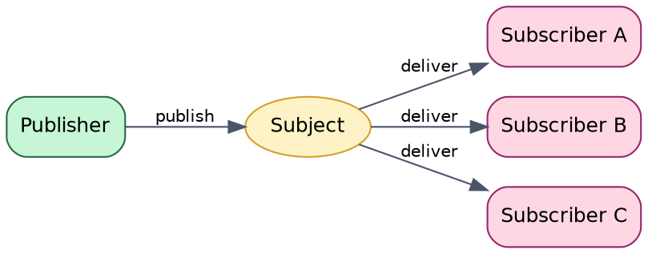
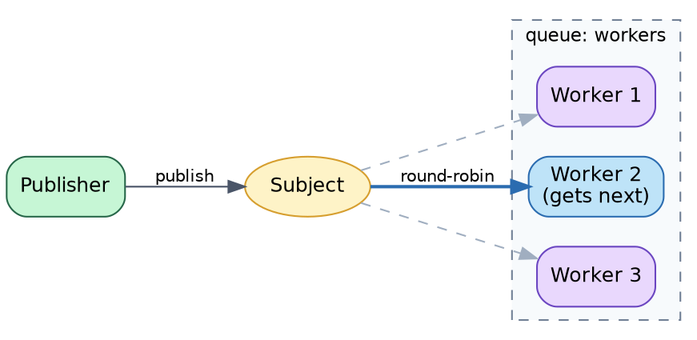
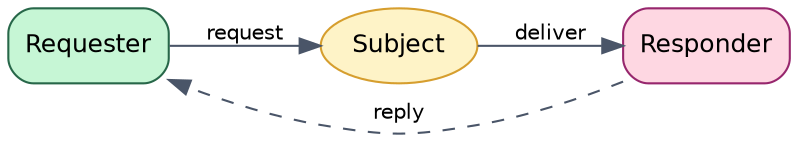

# Message Bus Design

## Overview

The bus package provides a pub/sub and request/reply messaging abstraction for agent-to-agent communication. It supports multiple backends (NATS, in-memory) while maintaining a consistent channel-based API.

## Goals

| Goal | Description |
|------|-------------|
| Backend agnostic | Single interface works with NATS, memory, or future backends |
| Go idiomatic | Channel-based API for concurrent use |
| Load balancing | Queue groups distribute work across agent instances |
| Request/reply | Built-in support for RPC-style interactions |
| Testing friendly | In-memory implementation for unit tests |

## Non-Goals

| Non-Goal | Reason |
|----------|--------|
| Message persistence | Use state package or NATS JetStream directly |
| Exactly-once delivery | At-most-once is sufficient for heartbeats/events |
| Complex routing | Keep it simple; use multiple subjects instead |
| Message ordering guarantees | Out of scope for this abstraction |

## Interface Design

```go
// MessageBus provides pub/sub and request/reply messaging.
type MessageBus interface {
    // Publish sends a message to all subscribers of a subject.
    Publish(subject string, data []byte) error

    // Subscribe creates a subscription to a subject.
    // All subscribers receive all messages.
    Subscribe(subject string) (Subscription, error)

    // QueueSubscribe creates a queue subscription.
    // Messages are load-balanced across queue members.
    QueueSubscribe(subject, queue string) (Subscription, error)

    // Request sends a request and waits for a single reply.
    Request(subject string, data []byte, timeout time.Duration) (*Message, error)

    // Close shuts down the bus connection.
    Close() error
}

// Subscription represents an active subscription.
type Subscription interface {
    // Messages returns channel for incoming messages.
    Messages() <-chan *Message

    // Unsubscribe cancels the subscription.
    Unsubscribe() error
}

// Message represents a message from the bus.
type Message struct {
    Subject string
    Data    []byte
    Reply   string // For request/reply pattern
}
```

## Messaging Patterns

### Publish/Subscribe (Fan-out)

All subscribers receive every message. Used for broadcasts and events.



### Queue Groups (Load Balance)

Messages distributed round-robin within a queue group. Used for work distribution.



### Request/Reply (RPC)

Synchronous request with single response. Uses ephemeral reply subjects.



## Implementations

### MemoryBus

In-memory implementation for testing and single-process scenarios.

| Feature | Implementation |
|---------|----------------|
| Storage | Go maps protected by RWMutex |
| Queue groups | Round-robin delivery to first available |
| Request/reply | Internal reply subject registry |
| Cleanup | Subscriptions tracked and closed on Close() |

**Use cases:** Unit tests, embedded agents, prototyping

### NATSBus

Production implementation using NATS messaging.

| Feature | Implementation |
|---------|----------------|
| Connection | Wraps nats.Conn with reconnection |
| Queue groups | Native NATS queue subscribe |
| Request/reply | Native NATS request/reply |
| Auth | Token, user/password supported |

**Configuration:**
- `URL` - NATS server URL
- `ReconnectWait` - Time between reconnection attempts
- `MaxReconnects` - Retry limit (-1 = unlimited)
- `ConnectTimeout` - Initial connection timeout

## Package Structure

```
bus/
├── bus.go         # Interface + Message type + errors
├── memory.go      # MemoryBus implementation
├── memory_test.go
├── nats.go        # NATSBus implementation
├── nats_test.go
└── doc.go         # Package documentation
```

## Queue Groups for Load Balancing

Queue groups enable horizontal scaling of message handlers:

```go
// Multiple workers share a queue - each message goes to exactly one
sub1, _ := bus.QueueSubscribe("tasks.process", "workers")
sub2, _ := bus.QueueSubscribe("tasks.process", "workers")
sub3, _ := bus.QueueSubscribe("tasks.process", "workers")

// Publishing 100 messages distributes ~33 to each worker
for i := 0; i < 100; i++ {
    bus.Publish("tasks.process", taskData)
}
```

**Selection algorithm:**
- MemoryBus: Round-robin to first subscriber with buffer space
- NATSBus: NATS server handles distribution (random with affinity)

## Usage Patterns

### Event Broadcasting

```go
// Publisher
bus.Publish("events.agent.started", eventData)

// Subscribers (all receive)
sub, _ := bus.Subscribe("events.agent.started")
for msg := range sub.Messages() {
    handleEvent(msg)
}
```

### Work Distribution

```go
// Workers (queue group)
sub, _ := bus.QueueSubscribe("tasks.analyze", "analyzer-pool")
for msg := range sub.Messages() {
    result := analyze(msg.Data)
    if msg.Reply != "" {
        bus.Publish(msg.Reply, result)
    }
}

// Dispatcher
bus.Publish("tasks.analyze", taskData)
```

### Synchronous RPC

```go
// Service
sub, _ := bus.Subscribe("rpc.calculate")
for msg := range sub.Messages() {
    result := calculate(msg.Data)
    bus.Publish(msg.Reply, result)
}

// Client
reply, err := bus.Request("rpc.calculate", requestData, 5*time.Second)
if err == ErrTimeout {
    // Handle timeout
}
```

## Error Handling

| Error | Meaning | Recovery |
|-------|---------|----------|
| `ErrClosed` | Bus has been closed | Reconnect or exit |
| `ErrTimeout` | Request timed out | Retry or fail |
| `ErrNoResponders` | No subscribers for request | Check service availability |
| `ErrInvalidSubject` | Empty or invalid subject | Fix subject string |

## Implementation Notes

### Buffer Sizing
- Default channel buffer: 256 messages
- Full buffers drop messages (non-blocking publish)
- Configurable via `Config.BufferSize`

### Thread Safety
- All operations are goroutine-safe
- Subscription channels can be read by multiple goroutines
- Close() waits for cleanup before returning

### Graceful Shutdown
1. `Close()` marks bus as closed
2. Active subscriptions are cancelled
3. Subscription channels are closed
4. Pending messages are dropped

## Testing Strategy

| Level | Focus |
|-------|-------|
| Unit | Message routing, queue group distribution |
| Integration | End-to-end pub/sub flows |
| Concurrency | Race conditions, deadlocks |
| Failure | Connection drops, timeouts |
