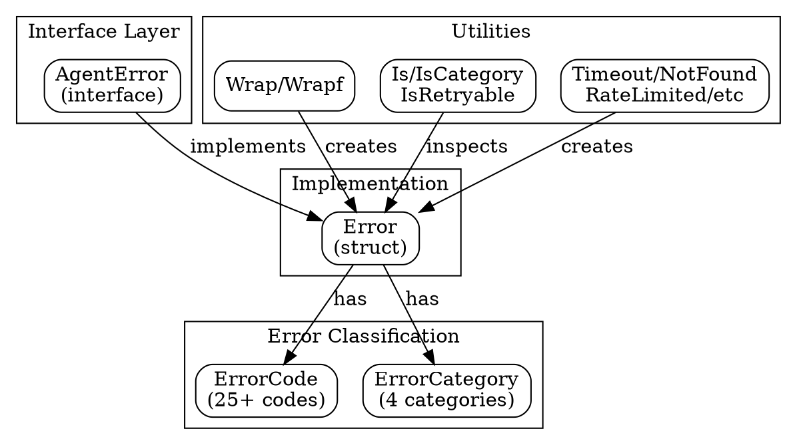

# Errors Package Design

## Overview

The errors package provides a structured error taxonomy for swarm coordination in agentkit. It defines comprehensive error types, codes, and categories that enable consistent error handling across distributed agent systems, with built-in retry semantics and JSON serialization for cross-agent communication.

## Goals

| Goal | Description |
|------|-------------|
| Structured errors | Rich error types with codes, categories, and metadata |
| Retry semantics | Clear retryable vs permanent error classification |
| Cross-agent communication | JSON serialization for error propagation between agents |
| Standard library compatible | Works with `errors.Is`, `errors.As`, and error wrapping |
| Context preservation | Wrap errors while maintaining original properties |
| Agent-specific errors | First-class support for swarm coordination failures |

## Non-Goals

| Non-Goal | Reason |
|----------|--------|
| Stack traces | Use slog or tracing for debugging; errors focus on semantics |
| Error logging | Errors are data; logging is a separate concern |
| Recovery strategies | Package provides classification; retry logic is caller's responsibility |
| Internationalization | Error messages are for developers, not end users |

## Architecture



## Error Taxonomy

### Categories

Errors are classified into four categories that determine default retry behavior:

| Category | Retryable | Description | Examples |
|----------|-----------|-------------|----------|
| `transient` | ✅ Yes | Temporary failures that may succeed on retry | Timeouts, network errors, service unavailable |
| `resource` | ✅ Yes | Resource exhaustion that may clear | Rate limits, quota exceeded, capacity |
| `permanent` | ❌ No | Failures where retry will not help | Not found, invalid input, unauthorized |
| `internal` | ❌ No | Bugs or system failures | Panics, assertions, corruption |

### Error Codes

Each error has a specific code identifying the failure type:

#### Transient Errors (Retryable)

| Code | Description | Default Category |
|------|-------------|------------------|
| `TIMEOUT` | Operation timed out | transient |
| `UNAVAILABLE` | Service temporarily unavailable | transient |
| `NETWORK_ERR` | Network connectivity issue | transient |
| `RETRY_LATER` | Server requested retry | transient |

#### Permanent Errors (Non-Retryable)

| Code | Description | Default Category |
|------|-------------|------------------|
| `NOT_FOUND` | Resource does not exist | permanent |
| `CONFLICT` | Conflicting operation or state | permanent |
| `INVALID_INPUT` | Malformed or invalid input | permanent |
| `UNAUTHORIZED` | Authentication failed | permanent |
| `FORBIDDEN` | Authorization denied | permanent |
| `ALREADY_EXISTS` | Resource already exists | permanent |
| `PRECONDITION` | Precondition not met | permanent |
| `UNSUPPORTED` | Operation not supported | permanent |
| `CANCELED` | Operation was canceled | permanent |

#### Resource Errors (Retryable)

| Code | Description | Default Category |
|------|-------------|------------------|
| `RATE_LIMITED` | Rate limit exceeded | resource |
| `QUOTA_EXCEEDED` | Resource quota exhausted | resource |
| `RESOURCE_BUSY` | Resource is busy/locked | resource |
| `CAPACITY` | System at capacity | resource |

#### Internal Errors (Non-Retryable)

| Code | Description | Default Category |
|------|-------------|------------------|
| `INTERNAL` | Unexpected internal error | internal |
| `CORRUPTION` | Data corruption detected | internal |
| `ASSERTION` | Assertion/invariant violation | internal |
| `PANIC` | Recovered from panic | internal |

#### Agent-Specific Errors

| Code | Description | Default Category |
|------|-------------|------------------|
| `AGENT_OFFLINE` | Target agent is offline | transient |
| `AGENT_BUSY` | Agent is processing another task | transient |
| `TASK_FAILED` | Task execution failed | permanent |
| `COORDINATION` | Swarm coordination failure | transient |
| `HANDOFF_FAILED` | Agent handoff failed | transient |
| `CAPABILITY_MISSING` | Required capability not available | permanent |

## Core Types

### AgentError Interface

```go
type AgentError interface {
    error
    
    // Code returns the specific error code identifying the failure type.
    Code() ErrorCode
    
    // Category returns the error category for retry/handling decisions.
    Category() ErrorCategory
    
    // Retryable returns true if the operation may succeed on retry.
    Retryable() bool
    
    // Metadata returns additional context as key-value pairs.
    Metadata() map[string]string
    
    // Unwrap returns the underlying error, if any.
    Unwrap() error
}
```

### Error Struct

```go
type Error struct {
    code      ErrorCode
    category  ErrorCategory
    message   string
    cause     error
    metadata  map[string]string
    retryable *bool           // nil = use category default
    timestamp time.Time
    agentID   string          // source agent, if applicable
    taskID    string          // related task, if applicable
}
```

### ErrorCategory

```go
type ErrorCategory string

const (
    CategoryTransient ErrorCategory = "transient"
    CategoryPermanent ErrorCategory = "permanent"
    CategoryResource  ErrorCategory = "resource"
    CategoryInternal  ErrorCategory = "internal"
)

// IsRetryable returns true for transient and resource categories
func (c ErrorCategory) IsRetryable() bool
```

### ErrorCode

```go
type ErrorCode string

// DefaultCategory returns the default category for the code
func (c ErrorCode) DefaultCategory() ErrorCategory

// DefaultRetryable returns whether the code is typically retryable
func (c ErrorCode) DefaultRetryable() bool

// Description returns a human-readable description
func (c ErrorCode) Description() string
```

## Error Wrapping and Unwrapping

The package integrates with Go's error wrapping conventions:

### Wrap Function

```go
// Wrap preserves AgentError properties while adding context
func Wrap(err error, message string, opts ...Option) *Error
```

**Behavior:**
- Returns `nil` if err is `nil`
- If err is an `AgentError`, preserves code, category, metadata, agentID, taskID
- Detects `context.DeadlineExceeded` → `TIMEOUT` code
- Detects `context.Canceled` → `CANCELED` code
- Unknown errors default to `INTERNAL` category

```
Original Error ────wrap────▶ Wrapped Error
    │                            │
    │ Code: NOT_FOUND           │ Code: NOT_FOUND (preserved)
    │ Category: permanent       │ Category: permanent (preserved)
    │ Message: "user missing"   │ Message: "fetch failed"
    │                            │ Cause: original error
    └────────────────────────────┘
```

### WrapWithCode

Override the error code explicitly:

```go
func WrapWithCode(err error, code ErrorCode, message string, opts ...Option) *Error
```

### Unwrap Support

Errors implement `Unwrap()` for use with standard library functions:

```go
// Works with errors.Is and errors.As
var agentErr *errors.Error
if errors.As(err, &agentErr) {
    log.Printf("Code: %s", agentErr.Code())
}
```

## Retry Semantics by Category

```
                          ┌─────────────────────────────────────────┐
                          │           Error Occurs                   │
                          └──────────────────┬──────────────────────┘
                                             │
                          ┌──────────────────▼──────────────────────┐
                          │        Check IsRetryable(err)           │
                          └──────────────────┬──────────────────────┘
                                             │
                    ┌────────────────────────┴────────────────────────┐
                    │                                                  │
           ┌────────▼────────┐                              ┌─────────▼─────────┐
           │   Retryable     │                              │   Not Retryable   │
           │ (transient,     │                              │ (permanent,       │
           │  resource)      │                              │  internal)        │
           └────────┬────────┘                              └─────────┬─────────┘
                    │                                                  │
           ┌────────▼────────┐                              ┌─────────▼─────────┐
           │ Apply backoff   │                              │ Return error      │
           │ Retry operation │                              │ immediately       │
           └─────────────────┘                              └───────────────────┘
```

### Default Retryability

| Category | Default Retryable |
|----------|-------------------|
| transient | ✅ Yes |
| resource | ✅ Yes |
| permanent | ❌ No |
| internal | ❌ No |

### Override Retryability

```go
// Make a normally retryable error non-retryable
err := errors.New(errors.ErrCodeTimeout, "permanent timeout", 
    errors.WithRetryable(false))

// Make a normally non-retryable error retryable
err := errors.New(errors.ErrCodeNotFound, "maybe retry",
    errors.WithRetryable(true))
```

## Functional Options

Configure errors with functional options:

| Option | Description |
|--------|-------------|
| `WithCategory(cat)` | Override default category |
| `WithRetryable(bool)` | Explicitly set retryability |
| `WithMetadata(k, v)` | Add single metadata pair |
| `WithMetadataMap(m)` | Add multiple metadata pairs |
| `WithAgentID(id)` | Set source agent ID |
| `WithTaskID(id)` | Set related task ID |
| `WithTimestamp(t)` | Set custom timestamp |
| `WithCause(err)` | Set underlying cause |

## JSON Serialization

Errors serialize to JSON for cross-agent communication:

```json
{
    "code": "NOT_FOUND",
    "category": "permanent",
    "message": "user not found",
    "cause": "database: no rows",
    "metadata": {
        "user_id": "123",
        "table": "users"
    },
    "retryable": false,
    "timestamp": "2024-01-15T10:30:00.000000000Z",
    "agent_id": "agent-1",
    "task_id": "task-42"
}
```

**Serialization notes:**
- Cause errors are serialized as strings (type information lost)
- Timestamps use RFC3339Nano format
- Empty/nil fields are omitted

## Usage Patterns

### Creating Errors

```go
// Basic error with code and message
err := errors.New(errors.ErrCodeTimeout, "operation timed out")

// Formatted message
err := errors.Newf(errors.ErrCodeNotFound, "user %s not found", userID)

// From code with default description
err := errors.FromCode(errors.ErrCodeRateLimit)

// Convenience constructors
err := errors.Timeout("database query timed out")
err := errors.NotFound("resource not found")
err := errors.RateLimited("too many requests")
err := errors.Unauthorized("invalid token")
err := errors.Forbidden("access denied")
err := errors.InvalidInput("missing required field")
err := errors.Conflict("version mismatch")
err := errors.Internal("unexpected state")

// Agent-specific errors
err := errors.AgentOffline("agent-123")
err := errors.TaskFailed("task-456", "execution timeout")
err := errors.CoordinationFailure("consensus failed")
```

### Adding Context

```go
// With metadata
err := errors.New(errors.ErrCodeNotFound, "user not found",
    errors.WithMetadata("user_id", "123"),
    errors.WithMetadata("source", "cache"),
)

// With agent context
err := errors.Timeout("coordination timeout",
    errors.WithAgentID("agent-a"),
    errors.WithTaskID("task-123"),
)
```

### Wrapping Errors

```go
// Wrap with context
result, err := db.Query(ctx, query)
if err != nil {
    return errors.Wrap(err, "failed to fetch user")
}

// Wrap with specific code
if err != nil {
    return errors.WrapWithCode(err, errors.ErrCodeUnavailable, 
        "database unavailable")
}

// Context errors are detected automatically
ctx, cancel := context.WithTimeout(ctx, 5*time.Second)
defer cancel()
err := longOperation(ctx)
wrapped := errors.Wrap(err, "operation failed")
// If ctx deadline exceeded, wrapped.Code() == ErrCodeTimeout
```

### Inspecting Errors

```go
// Check specific code
if errors.Is(err, errors.ErrCodeNotFound) {
    return defaultValue
}

// Check category
if errors.IsTransient(err) {
    scheduleRetry(err)
}

// Check retryability
if errors.IsRetryable(err) {
    time.Sleep(backoff)
    continue
}

// Extract AgentError
if agentErr := errors.AsAgentError(err); agentErr != nil {
    log.Printf("Error from agent %s: %s", 
        agentErr.AgentID(), agentErr.Code())
}

// Get metadata
meta := errors.GetMetadata(err)
if userID, ok := meta["user_id"]; ok {
    log.Printf("Failed for user: %s", userID)
}
```

### Retry Loop Pattern

```go
func withRetry(ctx context.Context, op func() error) error {
    var lastErr error
    for attempt := 0; attempt < maxRetries; attempt++ {
        err := op()
        if err == nil {
            return nil
        }
        
        lastErr = err
        
        // Don't retry permanent or internal errors
        if !errors.IsRetryable(err) {
            return err
        }
        
        // Apply backoff
        backoff := time.Duration(attempt+1) * 100 * time.Millisecond
        select {
        case <-ctx.Done():
            return errors.Wrap(ctx.Err(), "retry canceled")
        case <-time.After(backoff):
        }
    }
    return errors.Wrap(lastErr, "max retries exceeded")
}
```

### Panic Recovery

```go
func safeExecute(fn func()) (err *errors.Error) {
    defer func() {
        if r := recover(); r != nil {
            err = errors.RecoverPanic(r)
        }
    }()
    fn()
    return nil
}

// RecoverPanic returns an error with:
// - Code: PANIC
// - Category: internal
// - Metadata: {"panic_value": "<type>"}
```

### Error Collection

```go
// Collect multiple errors
var errs []error
for _, task := range tasks {
    if err := process(task); err != nil {
        errs = append(errs, err)
    }
}

// Check if any are retryable
if errors.AnyRetryable(errs) {
    scheduleRetry(errs)
}

// Find first retryable error
if retryable := errors.FirstRetryable(errs); retryable != nil {
    return retryable
}

// Join all errors
if len(errs) > 0 {
    return errors.Join(errs...)
}
```

## Integration with Other Packages

### With Bus (Message Passing)

```go
// Serialize error for transmission
agentErr := errors.NotFound("resource not found")
data, _ := json.Marshal(agentErr)
bus.Publish("errors.agent-1", data)

// Deserialize received error
msg := <-sub.Messages()
var agentErr errors.Error
json.Unmarshal(msg.Data, &agentErr)
if agentErr.Retryable() {
    scheduleRetry()
}
```

### With State (Distributed State)

```go
// Map state errors to agentkit errors
_, err := store.Get("key")
if err == state.ErrNotFound {
    return errors.NotFound("state key not found",
        errors.WithMetadata("key", "key"))
}
```

### With Tasks (Task Execution)

```go
// Task execution with error classification
func executeTask(task *Task) error {
    result, err := runTask(task)
    if err != nil {
        return errors.TaskFailed(task.ID, err.Error(),
            errors.WithCause(err),
            errors.WithAgentID(agentID),
        )
    }
    return nil
}
```

### With Ratelimit

```go
// Rate limiter returns agentkit errors
if !limiter.Allow() {
    return errors.RateLimited("request rate exceeded",
        errors.WithMetadata("limit", "100/min"),
    )
}
```

## Package Structure

```
errors/
├── doc.go         # Package documentation
├── errors.go      # AgentError interface, Error struct, constructors
├── codes.go       # ErrorCode, ErrorCategory definitions
├── wrap.go        # Wrap, inspection, and utility functions
└── errors_test.go # Comprehensive test coverage
```

## Error Handling Best Practices

1. **Use specific codes** - `ErrCodeNotFound` over `ErrCodeInternal`
2. **Add metadata** - Include IDs, counts, or other debugging context
3. **Preserve wrapped errors** - Use `Wrap` instead of creating new errors
4. **Check retryability** - Use `IsRetryable` before retry loops
5. **Set agent/task context** - Helps trace errors across swarm
6. **Don't log and return** - Either log or return, not both

## Testing Strategy

| Level | Focus |
|-------|-------|
| Unit | Error creation, code/category mapping |
| Wrapping | Wrap preserves properties, context detection |
| Serialization | JSON roundtrip preserves all fields |
| Inspection | Is/IsCategory/IsRetryable with wrapped errors |
| Concurrency | Metadata immutability, thread safety |
