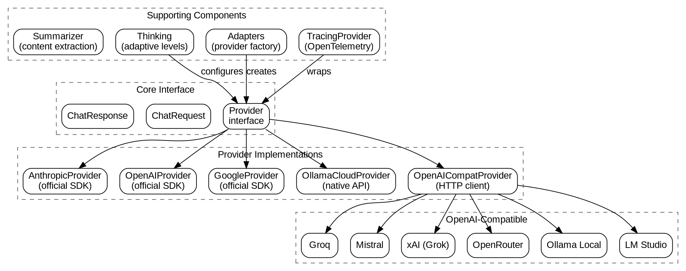

# LLM Package Design

## Overview

The llm package provides a unified interface for interacting with multiple Large Language Model providers. It abstracts provider-specific APIs behind a common `Provider` interface, enabling seamless switching between Anthropic, OpenAI, Google, and other LLM providers without changing application code.

## Goals

| Goal | Description |
|------|-------------|
| Provider agnostic | Single interface works with Anthropic, OpenAI, Google, Groq, Mistral, xAI, and more |
| Automatic provider inference | Infer provider from model name (e.g., `claude-*` → Anthropic) |
| Tool calling support | Unified tool definition and response parsing across providers |
| Adaptive thinking | Heuristic-based reasoning level selection (auto/off/low/medium/high) |
| Retry resilience | Exponential backoff for rate limits and transient errors |
| Extensible | Easy to add new OpenAI-compatible providers |

## Non-Goals

| Non-Goal | Reason |
|----------|--------|
| Streaming to clients | Focus on request/response; streaming handled internally when required |
| Model fine-tuning | Out of scope for inference abstraction |
| Token counting | Use provider-reported tokens, not pre-calculation |
| Cost tracking | Delegated to telemetry/billing layers |

## Architecture



## Core Types

### Provider Interface

```go
// Provider is the interface for LLM providers.
type Provider interface {
    // Chat sends a chat request and returns the response.
    Chat(ctx context.Context, req ChatRequest) (*ChatResponse, error)
}
```

### Message

```go
// Message represents an LLM message.
type Message struct {
    Role       string             `json:"role"`       // user, assistant, tool, system
    Content    string             `json:"content"`
    ToolCalls  []ToolCallResponse `json:"tool_calls,omitempty"`
    ToolCallID string             `json:"tool_call_id,omitempty"` // For tool result messages
}
```

### ChatRequest

```go
// ChatRequest represents a chat request to the LLM.
type ChatRequest struct {
    Messages  []Message `json:"messages"`
    Tools     []ToolDef `json:"tools,omitempty"`
    MaxTokens int       `json:"max_tokens,omitempty"`
}
```

### ChatResponse

```go
// ChatResponse represents a chat response from the LLM.
type ChatResponse struct {
    Content      string             `json:"content"`
    Thinking     string             `json:"thinking,omitempty"`     // Extended thinking output
    ToolCalls    []ToolCallResponse `json:"tool_calls,omitempty"`
    StopReason   string             `json:"stop_reason"`
    InputTokens  int                `json:"input_tokens"`
    OutputTokens int                `json:"output_tokens"`
    Model        string             `json:"model"`
    TTFTMs       int64              `json:"ttft_ms,omitempty"`      // Time to first token
}
```

### Tool Types

```go
// ToolDef represents a tool definition for the LLM.
type ToolDef struct {
    Name        string                 `json:"name"`
    Description string                 `json:"description"`
    Parameters  map[string]interface{} `json:"parameters"` // JSON Schema
}

// ToolCallResponse represents a tool call from the LLM.
type ToolCallResponse struct {
    ID   string                 `json:"id"`
    Name string                 `json:"name"`
    Args map[string]interface{} `json:"args"`
}
```

## Provider Implementations

### AnthropicProvider

Uses the official Anthropic SDK for Claude models.

| Feature | Implementation |
|---------|----------------|
| SDK | `github.com/anthropics/anthropic-sdk-go` |
| Auth | API key (`x-api-key`) or OAuth token (`Bearer`) |
| Thinking | Extended thinking with budget tokens |
| Streaming | Required for extended thinking, optional otherwise |
| Tool format | Native Anthropic tool_use blocks |

**Supported models:** claude-3-5-sonnet, claude-3-opus, claude-3-haiku, claude-4-*

### OpenAIProvider

Uses the official OpenAI SDK.

| Feature | Implementation |
|---------|----------------|
| SDK | `github.com/openai/openai-go` |
| Auth | API key |
| Reasoning | ReasoningEffort for o1/o3 models |
| Tool format | Function calling |

**Supported models:** gpt-4o, gpt-4-turbo, gpt-3.5-turbo, o1-*, o3-*

### GoogleProvider

Uses the official Google Generative AI SDK for Gemini models.

| Feature | Implementation |
|---------|----------------|
| SDK | `github.com/google/generative-ai-go/genai` |
| Auth | API key |
| Tool format | FunctionDeclaration |
| Schema | Converts JSON Schema to Gemini Schema |

**Supported models:** gemini-1.5-pro, gemini-1.5-flash, gemini-2.0-*, gemma-*

### OllamaCloudProvider

Uses Ollama's native `/api/chat` endpoint for hosted Ollama models.

| Feature | Implementation |
|---------|----------------|
| API | Native Ollama HTTP API |
| Auth | Bearer token |
| Thinking | Boolean or string level ("low"/"medium"/"high") |
| Default URL | `https://ollama.com` |

### OpenAICompatProvider

Generic provider for any OpenAI-compatible API.

| Feature | Implementation |
|---------|----------------|
| API | OpenAI chat completions format |
| Auth | Bearer token (optional for local) |
| Custom URL | Configurable base URL |

**Pre-configured variants:**

| Provider | Base URL | API Key Required |
|----------|----------|------------------|
| Groq | `https://api.groq.com/openai/v1` | Yes |
| Mistral | `https://api.mistral.ai/v1` | Yes |
| xAI | `https://api.x.ai/v1` | Yes |
| OpenRouter | `https://openrouter.ai/api/v1` | Yes |
| Ollama Local | `http://localhost:11434/v1` | No |
| LM Studio | `http://localhost:1234/v1` | No |

## Provider Inference

The package can infer the provider from the model name:

```go
// Model name → Provider
"claude-3-5-sonnet-20241022"  → "anthropic"
"gpt-4o"                       → "openai"
"o1-preview"                   → "openai"
"gemini-1.5-pro"               → "google"
"mistral-large-latest"         → "mistral"
"grok-2"                       → "xai"
```

**Inference rules:**

| Model Prefix | Provider |
|--------------|----------|
| `claude*` | anthropic |
| `gpt-*`, `o1*`, `o3*`, `chatgpt*` | openai |
| `gemini*`, `gemma*` | google |
| `mistral*`, `mixtral*`, `codestral*`, `pixtral*` | mistral |
| `grok*` | xai |
| `llama*` | groq |

## Thinking/Reasoning Support

The package supports adaptive thinking levels that adjust reasoning effort based on request complexity.

### Thinking Levels

```go
type ThinkingLevel string

const (
    ThinkingOff    ThinkingLevel = "off"    // No extended thinking
    ThinkingLow    ThinkingLevel = "low"    // Light reasoning
    ThinkingMedium ThinkingLevel = "medium" // Moderate reasoning
    ThinkingHigh   ThinkingLevel = "high"   // Deep reasoning
    ThinkingAuto   ThinkingLevel = "auto"   // Heuristic-based selection
)
```

### Auto Mode Heuristics

When `ThinkingAuto` is set, the classifier analyzes the request:

| Complexity | Triggers | Level |
|------------|----------|-------|
| High | Math proofs, system design, security analysis, >3000 chars, >10 tools | High |
| Medium | Code implementation, step-by-step, refactoring, >1000 chars, >5 tools | Medium |
| Low | "How to" questions, recommendations, >300 chars, >2 tools | Low |
| Off | Simple greetings, short queries | Off |

**Detection patterns:**

```go
// High complexity keywords
"prove", "derive", "architect", "design system", "security analysis", "debug", "root cause"

// Medium complexity keywords  
"implement", "refactor", "optimize", "step by step", "function", "class", "algorithm"

// Low complexity keywords
"how to", "what is the best", "should i", "summarize", "list"
```

### Provider-Specific Implementation

| Provider | Thinking Support |
|----------|-----------------|
| Anthropic | Extended thinking with budget tokens (requires streaming) |
| OpenAI | ReasoningEffort for o1/o3 models |
| Ollama Cloud | `think` parameter (bool or level string) |
| Others | Not directly supported |

**Anthropic budget defaults:**

| Level | Budget Tokens |
|-------|---------------|
| High | 16,000 |
| Medium | 8,000 |
| Low | 4,000 |

## Tool Calling Patterns

### Request with Tools

```go
resp, err := provider.Chat(ctx, ChatRequest{
    Messages: []Message{
        {Role: "user", Content: "Read the file /etc/hosts"},
    },
    Tools: []ToolDef{
        {
            Name:        "read",
            Description: "Read a file from the filesystem",
            Parameters: map[string]interface{}{
                "type": "object",
                "properties": map[string]interface{}{
                    "path": map[string]interface{}{
                        "type":        "string",
                        "description": "Path to the file",
                    },
                },
                "required": []string{"path"},
            },
        },
    },
})
```

### Handling Tool Calls

```go
if len(resp.ToolCalls) > 0 {
    // Execute tools and collect results
    var toolResults []Message
    
    for _, tc := range resp.ToolCalls {
        result := executeToolCall(tc.Name, tc.Args)
        toolResults = append(toolResults, Message{
            Role:       "tool",
            ToolCallID: tc.ID,
            Content:    result,
        })
    }
    
    // Continue conversation with tool results
    messages = append(messages, Message{
        Role:      "assistant",
        ToolCalls: resp.ToolCalls,
    })
    messages = append(messages, toolResults...)
    
    // Get final response
    finalResp, _ := provider.Chat(ctx, ChatRequest{
        Messages: messages,
        Tools:    tools,
    })
}
```

## Error Handling and Retries

### Error Classification

| Error Type | Detection | Retryable |
|------------|-----------|-----------|
| Rate limit | 429, "rate limit", "too many requests" | Yes |
| Server error | 5xx, "internal server error", "bad gateway" | Yes |
| Billing | 402, "billing", "payment", "credits", "quota" | No (fatal) |
| Auth | 401, "unauthorized", "invalid api key" | No |

### Retry Configuration

```go
type RetryConfig struct {
    MaxRetries   int           // Max attempts (default: 5)
    InitBackoff  time.Duration // Initial wait (default: 1s)
    MaxBackoff   time.Duration // Maximum wait (default: 60s)
}
```

**Exponential backoff:**
- Backoff doubles after each retry
- Capped at MaxBackoff
- Context cancellation respected

### Billing Error Handling

Billing errors are never retried and immediately return:

```go
if isBillingError(err) {
    return nil, fmt.Errorf("billing/payment error (fatal): %w", err)
}
```

## Configuration

### ProviderConfig

```go
type ProviderConfig struct {
    Provider     string         // anthropic, openai, google, groq, etc.
    Model        string         // Model name
    APIKey       string         // API key or OAuth token
    IsOAuthToken bool           // True if APIKey is OAuth (Anthropic only)
    MaxTokens    int            // Required: max response tokens
    BaseURL      string         // Custom API endpoint
    Thinking     ThinkingConfig // Thinking/reasoning settings
    RetryConfig  RetryConfig    // Retry settings
}
```

### ThinkingConfig

```go
type ThinkingConfig struct {
    Level        ThinkingLevel // auto, off, low, medium, high
    BudgetTokens int64         // Anthropic budget (0 = use defaults)
}
```

## Package Structure


## Usage Patterns

### Basic Chat

```go
provider, err := llm.NewProvider(llm.ProviderConfig{
    Model:     "claude-3-5-sonnet-20241022",  // Provider inferred
    APIKey:    os.Getenv("ANTHROPIC_API_KEY"),
    MaxTokens: 4096,
})

resp, err := provider.Chat(ctx, llm.ChatRequest{
    Messages: []llm.Message{
        {Role: "system", Content: "You are a helpful assistant."},
        {Role: "user", Content: "Hello!"},
    },
})

fmt.Println(resp.Content)
```

### With Adaptive Thinking

```go
provider, _ := llm.NewProvider(llm.ProviderConfig{
    Model:     "claude-3-5-sonnet-20241022",
    APIKey:    apiKey,
    MaxTokens: 8192,
    Thinking: llm.ThinkingConfig{
        Level: llm.ThinkingAuto,  // Auto-detect complexity
    },
})

// Simple query → no thinking
resp, _ := provider.Chat(ctx, llm.ChatRequest{
    Messages: []llm.Message{
        {Role: "user", Content: "What time is it?"},
    },
})

// Complex query → extended thinking
resp, _ = provider.Chat(ctx, llm.ChatRequest{
    Messages: []llm.Message{
        {Role: "user", Content: "Design a distributed cache system with consistency guarantees"},
    },
})
// resp.Thinking contains the reasoning process
```

### With OpenTelemetry Tracing

```go
baseProvider, _ := llm.NewProvider(cfg)
provider := llm.WithTracing(baseProvider, "anthropic")

// All Chat calls now generate spans with:
// - Provider name
// - Model
// - Input/output tokens
// - Response content
// - Thinking content (if any)
```

### Using OpenAI-Compatible Provider

```go
// Using OpenRouter to access multiple models
provider, _ := llm.NewProvider(llm.ProviderConfig{
    Provider:  "openrouter",
    Model:     "anthropic/claude-3-opus",
    APIKey:    os.Getenv("OPENROUTER_API_KEY"),
    MaxTokens: 4096,
})

// Using local Ollama
provider, _ = llm.NewProvider(llm.ProviderConfig{
    Provider:  "ollama-local",
    Model:     "llama3",
    MaxTokens: 4096,
    // No API key needed
})

// Using custom endpoint (e.g., LiteLLM)
provider, _ = llm.NewProvider(llm.ProviderConfig{
    Provider:  "openai-compat",
    BaseURL:   "https://my-litellm-proxy.com/v1",
    Model:     "gpt-4",
    APIKey:    "my-key",
    MaxTokens: 4096,
})
```

### Content Summarization

```go
summarizer := llm.NewSummarizer(provider)

summary, err := summarizer.Summarize(ctx, 
    webPageContent,
    "What are the main features of this product?",
)
```

## Testing

### MockProvider

```go
provider := llm.NewMockProvider()
provider.SetResponse("Test response")
provider.SetToolCall("read", map[string]interface{}{"path": "/test"})
provider.SetTokenCounts(100, 50)

resp, _ := provider.Chat(ctx, request)

// Inspect captured request
lastReq := provider.LastRequest()
callCount := provider.CallCount()
```

### Custom Mock Behavior

```go
provider := llm.NewMockProvider()
provider.ChatFunc = func(ctx context.Context, req llm.ChatRequest) (*llm.ChatResponse, error) {
    // Custom logic
    if strings.Contains(req.Messages[0].Content, "error") {
        return nil, errors.New("simulated error")
    }
    return &llm.ChatResponse{Content: "Custom response"}, nil
}
```

## Testing Strategy

| Level | Focus |
|-------|-------|
| Unit | Provider creation, config validation, inference |
| Mock server | HTTP request/response format, tool calls |
| Integration | Real provider calls (manual/CI with keys) |
| Thinking | Heuristic classification accuracy |
| Retry | Backoff timing, error classification |
