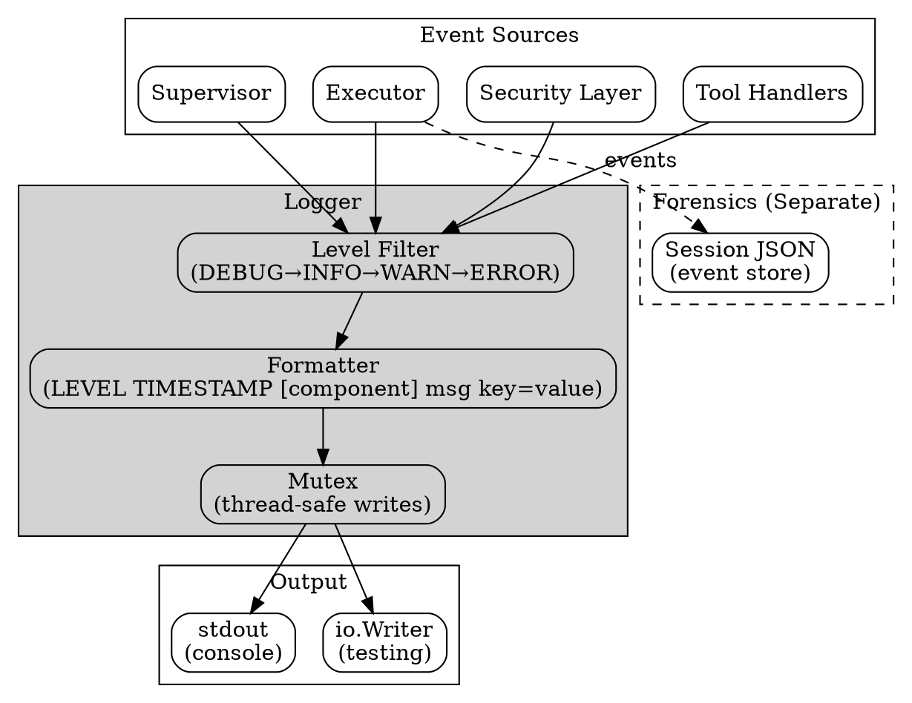
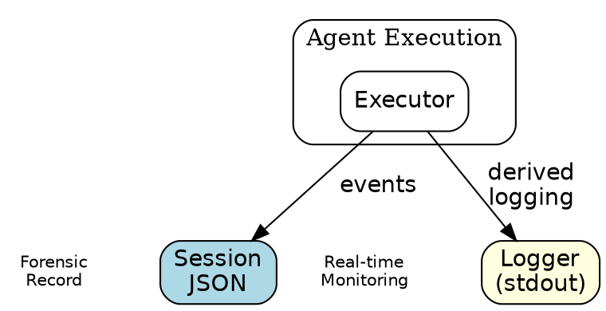

# Logging Design

## Overview

The logging package provides real-time structured logging for agent monitoring and debugging. It produces human-readable console output derived from execution events, serving as the real-time view into agent behavior.

**Key insight:** The session JSON is THE forensic record. Logging provides optional real-time console output for monitoring—it does not duplicate data storage.

## Goals

| Goal | Description |
|------|-------------|
| Real-time monitoring | Immediate visibility into agent execution |
| Structured fields | Key-value pairs for machine parsing |
| Human readable | Clear format for console/terminal viewing |
| Level filtering | Control verbosity via log levels |
| Component isolation | Per-subsystem loggers with context |
| Thread safety | Safe concurrent use from multiple goroutines |

## Non-Goals

| Non-Goal | Reason |
|----------|--------|
| Forensic storage | Session JSON handles this |
| Log aggregation | External systems (ELK, etc.) handle this |
| Log rotation | OS-level concern (logrotate) |
| Structured JSON output | Keep format simple and readable |
| Async buffering | Synchronous writes are fine for console |

## Core Types

### Level

```go
type Level string

const (
    LevelDebug Level = "DEBUG"  // Verbose tracing
    LevelInfo  Level = "INFO"   // Normal operations
    LevelWarn  Level = "WARN"   // Potential issues
    LevelError Level = "ERROR"  // Failures
)
```

### Fields

```go
// Fields is a map of structured log fields.
// Type alias provides semantic clarity over raw map[string]interface{}.
type Fields = map[string]interface{}
```

### Logger

```go
type Logger struct {
    mu        sync.Mutex   // Protects output writes
    output    io.Writer    // Destination (default: stdout)
    minLevel  Level        // Minimum level to log
    component string       // Logger name for context
    traceID   string       // Request correlation ID
}
```

## Architecture



## Log Levels

Levels control verbosity. Each level includes all higher-severity levels.

| Level | Priority | Use Case | Examples |
|-------|----------|----------|----------|
| DEBUG | 0 | Verbose tracing | Tool calls, phase transitions, security decisions |
| INFO | 1 | Normal operations | Goal start/complete, execution lifecycle |
| WARN | 2 | Potential issues | Security warnings, degraded operation |
| ERROR | 3 | Failures | Tool errors, execution failures |

**Default level:** INFO (filters out DEBUG)

```go
// Set to DEBUG for verbose output
logger.SetLevel(LevelDebug)

// Set to WARN for production (quieter)
logger.SetLevel(LevelWarn)
```

## Structured Fields

Fields add machine-parseable context to log messages:

```go
logger.Info("tool_call", map[string]interface{}{
    "tool":     "bash",
    "duration": "150ms",
    "exit":     0,
})
// Output: INFO  2026-02-23T12:00:00.000Z tool_call tool=bash duration=150ms exit=0
```

**Field formatting:**
- Keys and values joined with `=`
- Multiple fields space-separated
- Appended after message text

## Output Format

The logger produces a consistent, human-readable format:

```
LEVEL TIMESTAMP [component] message key=value key2=value2
```

**Examples:**
```
INFO  2026-02-23T12:00:00.000Z [executor] goal_start goal=analyze-data
DEBUG 2026-02-23T12:00:01.234Z [executor] tool_call tool=read
INFO  2026-02-23T12:00:02.567Z [executor] goal_complete goal=analyze-data duration=2.567s
WARN  2026-02-23T12:00:03.000Z [security] MCP policy not configured security=true
ERROR 2026-02-23T12:00:04.000Z [executor] tool_error tool=bash error=exit status 1
```

**Format details:**
- Level: Left-padded to 5 chars for alignment
- Timestamp: UTC ISO-8601 with milliseconds
- Component: In brackets, optional
- Message: Free-form text
- Fields: Key=value pairs

## Thread Safety

The Logger uses a mutex to protect concurrent writes:

```go
func (l *Logger) log(level Level, msg string, fields ...map[string]interface{}) {
    // ... format line ...
    
    l.mu.Lock()
    defer l.mu.Unlock()
    l.output.Write([]byte(line))
}
```

**Thread-safe operations:**
- All logging methods (Debug, Info, Warn, Error)
- Event-derived methods (ToolCall, GoalStart, etc.)
- Output writes are atomic per log line

**Not thread-safe (call before concurrent use):**
- `SetLevel()` - Set once at startup
- `SetOutput()` - Set once at startup

## Package Structure

```
logging/
├── logging.go       # Logger implementation + event methods
└── logging_test.go  # Unit tests
```

## Relationship to Session Forensics

The logging package and session JSON serve complementary purposes:

| Aspect | Logging | Session JSON |
|--------|---------|--------------|
| Purpose | Real-time monitoring | Post-mortem analysis |
| Persistence | Transient (console) | Durable (file/store) |
| Format | Human-readable text | Structured JSON |
| Content | Summary/highlights | Complete events |
| Timing | Immediate | Batched/async |

**Design principle:** The executor adds events to the session (forensic record), then calls logging methods for real-time output. No data duplication—logging derives from session events.

```go
// In executor:
session.AddEvent(ToolCallEvent{...})   // Forensic record
logger.ToolCall("bash", args)           // Real-time output (derived)
```

## Event-Derived Logging Methods

Specialized methods log common execution events:

### Execution Lifecycle

```go
// Workflow start/end
logger.ExecutionStart("my-workflow")
logger.ExecutionComplete("my-workflow", duration, "complete")

// Goal start/end
logger.GoalStart("analyze-data")
logger.GoalComplete("analyze-data", duration)

// Phase tracking
logger.PhaseStart("PLAN", "analyze", "step-1")
logger.PhaseComplete("PLAN", "analyze", "step-1", duration, "success")
```

### Tool Operations

```go
// Tool invocation
logger.ToolCall("read", map[string]interface{}{"path": "/tmp/data"})

// Tool result (includes error handling)
logger.ToolResult("read", 150*time.Millisecond, nil)           // Success
logger.ToolResult("bash", 5*time.Second, errors.New("timeout")) // Error
```

### Security Events

```go
// Security warnings
logger.SecurityWarning("MCP policy not configured", nil)

// Security decisions
logger.SecurityDecision("exec", "allowed", "in allowlist")

// Supervisor verdicts
logger.SupervisorVerdict("deploy", "step-3", "rejected", "needs review", true)
```

### Supervision Phases

```go
// RECONCILE phase details
logger.ReconcilePhase("analyze", "step-1", []string{"timeout"}, false)

// SUPERVISE phase details
logger.SupervisePhase("deploy", "step-2", "approved", "safe operation")
```

## Usage Patterns

### Basic Logging

```go
logger := logging.New()
logger.SetLevel(logging.LevelInfo)

logger.Info("server started", map[string]interface{}{
    "port": 8080,
    "env":  "production",
})
```

### Component Logger

```go
// Create component-scoped logger
execLogger := logging.New().WithComponent("executor")
secLogger := logging.New().WithComponent("security")

execLogger.Info("goal started")  // INFO ... [executor] goal started
secLogger.Warn("policy missing") // WARN ... [security] policy missing
```

### Trace Correlation

```go
// Add trace ID for request correlation
reqLogger := logger.WithTraceID("req-abc-123")

reqLogger.Info("processing request")
// Can be used for distributed tracing correlation
```

### Testing with Buffer

```go
func TestMyComponent(t *testing.T) {
    var buf bytes.Buffer
    logger := logging.New()
    logger.SetOutput(&buf)
    logger.SetLevel(logging.LevelDebug)
    
    // Run code that logs
    myComponent.DoWork(logger)
    
    // Assert on log output
    output := buf.String()
    if !strings.Contains(output, "expected message") {
        t.Errorf("expected log message, got: %s", output)
    }
}
```

### Execution Flow Logging

```go
func (e *Executor) Run(workflow string) error {
    logger := e.logger.WithComponent("executor")
    
    logger.ExecutionStart(workflow)
    start := time.Now()
    defer func() {
        logger.ExecutionComplete(workflow, time.Since(start), "complete")
    }()
    
    for _, goal := range workflow.Goals {
        logger.GoalStart(goal.Name)
        goalStart := time.Now()
        
        if err := e.executeGoal(goal); err != nil {
            logger.Error("goal_failed", map[string]interface{}{
                "goal":  goal.Name,
                "error": err.Error(),
            })
            return err
        }
        
        logger.GoalComplete(goal.Name, time.Since(goalStart))
    }
    
    return nil
}
```

## Error Handling

The logging package is designed to never fail or block execution:

| Scenario | Behavior |
|----------|----------|
| Write error | Silently ignored (logging shouldn't crash the app) |
| Nil fields map | Handled gracefully (no fields output) |
| Empty message | Logged as-is |
| Invalid level | Uses INFO as default |

**Philosophy:** Logging is observability, not business logic. A logging failure should never interrupt agent execution.

## Configuration

```go
logger := logging.New()

// Set minimum log level (default: INFO)
logger.SetLevel(logging.LevelDebug)

// Set output destination (default: os.Stdout)
logger.SetOutput(os.Stderr)
logger.SetOutput(&myBuffer)
logger.SetOutput(io.Discard)  // Silence all output
```

## Integration with AgentKit

The logging package integrates with other AgentKit components:



## Testing Strategy

| Level | Focus |
|-------|-------|
| Unit | Level filtering, field formatting, output format |
| Integration | Component logger inheritance |
| Concurrency | Thread-safe writes under load |
| Format | Log line parsing, timestamp format |
