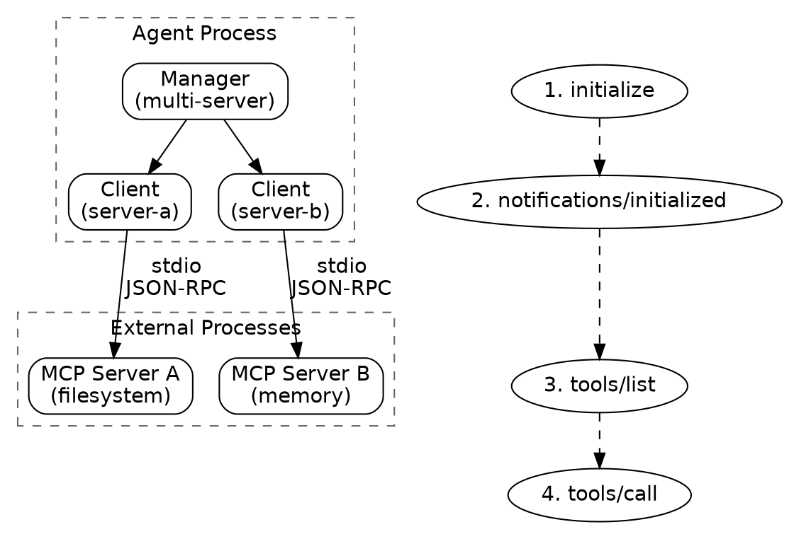
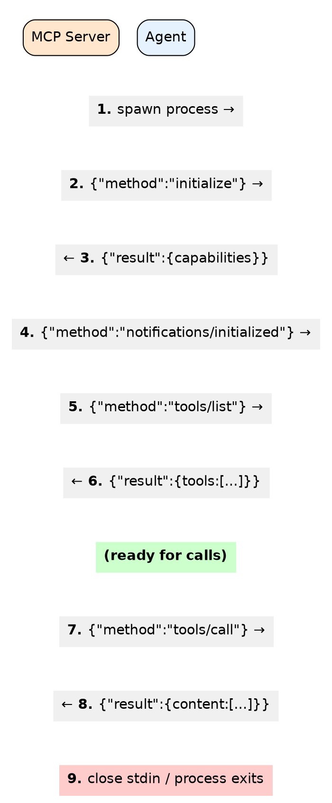
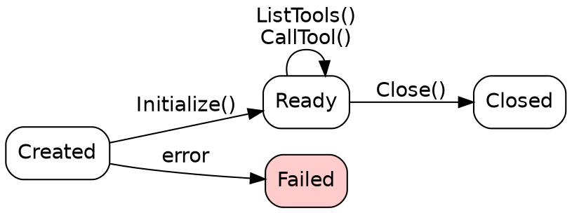
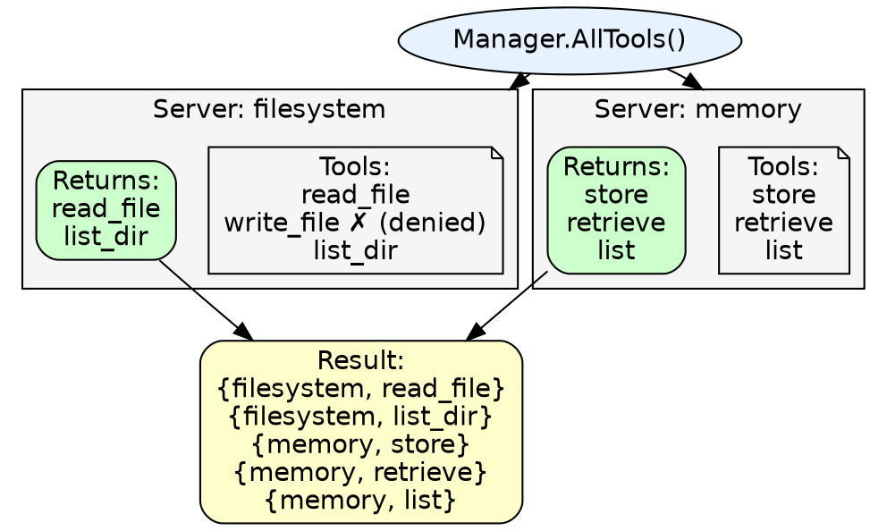

# MCP Client Design

## Overview

The mcp package provides Model Context Protocol (MCP) client support for connecting to external tool servers. MCP enables agents to discover and invoke tools from any MCP-compliant server using JSON-RPC 2.0 over stdio.

## Goals

| Goal | Description |
|------|-------------|
| External tools | Connect to MCP servers that provide tools (filesystem, memory, custom) |
| Tool discovery | Automatically discover available tools from connected servers |
| Multi-server | Manage connections to multiple MCP servers simultaneously |
| Standard protocol | Implement MCP specification using JSON-RPC 2.0 |
| Tool filtering | Allow denying specific tools from being exposed to LLMs |

## Non-Goals

| Non-Goal | Reason |
|----------|--------|
| Server implementation | Only client-side; servers are external processes |
| HTTP transport | stdio-only; HTTP/SSE transport out of scope |
| Resource/prompt support | Focus on tool invocation only |
| Server process management | Just start/stop; no health monitoring or restart |

## Core Types

### Tool

```go
// Tool represents an MCP tool definition.
type Tool struct {
    Name        string                 `json:"name"`
    Description string                 `json:"description"`
    InputSchema map[string]interface{} `json:"inputSchema"`
}
```

### ServerConfig

```go
// ServerConfig configures an MCP server connection.
type ServerConfig struct {
    Command string            `json:"command"`  // Executable to run
    Args    []string          `json:"args"`     // Command arguments
    Env     map[string]string `json:"env"`      // Environment variables
}
```

### JSON-RPC Types

```go
// Request is a JSON-RPC 2.0 request.
type Request struct {
    JSONRPC string      `json:"jsonrpc"`
    ID      int64       `json:"id"`
    Method  string      `json:"method"`
    Params  interface{} `json:"params,omitempty"`
}

// Response is a JSON-RPC 2.0 response.
type Response struct {
    JSONRPC string          `json:"jsonrpc"`
    ID      int64           `json:"id"`
    Result  json.RawMessage `json:"result,omitempty"`
    Error   *RPCError       `json:"error,omitempty"`
}

// RPCError represents a JSON-RPC error.
type RPCError struct {
    Code    int    `json:"code"`
    Message string `json:"message"`
}
```

### Tool Call Types

```go
// ToolCallParams are the parameters for tools/call.
type ToolCallParams struct {
    Name      string                 `json:"name"`
    Arguments map[string]interface{} `json:"arguments,omitempty"`
}

// ToolCallResult is the result of tools/call.
type ToolCallResult struct {
    Content []Content `json:"content"`
    IsError bool      `json:"isError"`
}

// Content represents content in a tool result.
type Content struct {
    Type string `json:"type"`           // "text" or "image"
    Text string `json:"text,omitempty"` // For text content
    Data string `json:"data,omitempty"` // Base64 for images
}
```

## Architecture



## Client Lifecycle

### Connection Flow



### Lifecycle Methods

| Method | Description |
|--------|-------------|
| `NewClient(config)` | Spawns server process, sets up stdio pipes |
| `Initialize(ctx)` | Performs MCP handshake, sends initialized notification |
| `ListTools(ctx)` | Fetches and caches available tools |
| `CallTool(ctx, name, args)` | Invokes a tool and returns result |
| `Close()` | Closes stdin, waits for process exit |

### State Machine



## Manager for Multiple Servers

The Manager coordinates connections to multiple MCP servers:

```go
type Manager struct {
    clients     map[string]*Client        // server name -> client
    deniedTools map[string]map[string]bool // server -> tool -> denied
    mu          sync.RWMutex
}
```

### Manager Operations

| Method | Description |
|--------|-------------|
| `Connect(ctx, name, config)` | Connect to a server, initialize, and fetch tools |
| `Disconnect(name)` | Close connection to a specific server |
| `AllTools()` | Get all tools from all servers (excluding denied) |
| `FindTool(name)` | Find which server provides a tool |
| `CallTool(ctx, server, tool, args)` | Call a tool on a specific server |
| `SetDeniedTools(server, tools)` | Exclude tools from being exposed |
| `Servers()` | List connected server names |
| `Close()` | Disconnect all servers |

### Tool Aggregation



## JSON-RPC Protocol Details

### Message Format

All messages are newline-delimited JSON over stdio:

```json
{"jsonrpc":"2.0","id":1,"method":"initialize","params":{...}}
{"jsonrpc":"2.0","id":1,"result":{...}}
```

### Request ID Management

- Atomic counter generates unique IDs
- Pending requests tracked in `map[int64]chan *Response`
- Responses matched to requests by ID
- Context cancellation supported

### Notifications vs Requests

| Type | Has ID | Expects Response |
|------|--------|------------------|
| Request | Yes | Yes |
| Notification | No | No |

```go
// Request - expects response
{"jsonrpc":"2.0","id":1,"method":"tools/list","params":{}}

// Notification - fire and forget
{"jsonrpc":"2.0","method":"notifications/initialized"}
```

### Protocol Version

The client uses protocol version `2024-11-05` during initialization.

## Tool Discovery and Invocation

### Discovery

```go
// 1. Connect and initialize
client, _ := mcp.NewClient(config)
client.Initialize(ctx)

// 2. List tools
tools, _ := client.ListTools(ctx)

// 3. Tools include JSON Schema for input validation
for _, tool := range tools {
    fmt.Printf("%s: %s\n", tool.Name, tool.Description)
    fmt.Printf("  Schema: %v\n", tool.InputSchema)
}
```

### Invocation

```go
// Call a tool with arguments
result, err := client.CallTool(ctx, "read_file", map[string]interface{}{
    "path": "/tmp/example.txt",
})

// Result contains content array
for _, content := range result.Content {
    switch content.Type {
    case "text":
        fmt.Println(content.Text)
    case "image":
        // content.Data is base64-encoded
    }
}
```

### ToolWithServer

When using Manager, tools are paired with their server:

```go
type ToolWithServer struct {
    Server string
    Tool   Tool
}

// Find and call
if server, found := manager.FindTool("read_file"); found {
    result, _ := manager.CallTool(ctx, server, "read_file", args)
}
```

## Error Handling

### Error Types

| Error | Source | Meaning |
|-------|--------|---------|
| `RPCError` | Server | JSON-RPC error with code and message |
| Process error | Client | Server process failed to start/crashed |
| Context error | Client | Request cancelled or timed out |
| "not initialized" | Client | Called method before Initialize() |
| "server not connected" | Manager | Unknown server name |

### JSON-RPC Error Codes

| Code | Meaning |
|------|---------|
| -32700 | Parse error |
| -32600 | Invalid request |
| -32601 | Method not found |
| -32602 | Invalid params |
| -32603 | Internal error |

### Tool-Level Errors

Tools can indicate errors via `IsError` field:

```go
result, err := client.CallTool(ctx, "read_file", args)
if err != nil {
    // RPC or transport error
    return err
}
if result.IsError {
    // Tool returned an error (e.g., file not found)
    return fmt.Errorf("tool error: %s", result.Content[0].Text)
}
```

## Package Structure

```
mcp/
├── client.go      # Client, Tool, Request/Response types
├── manager.go     # Manager for multiple servers
└── mcp_test.go    # Unit tests
```

## Usage Patterns

### Single Server

```go
// Configure server
config := mcp.ServerConfig{
    Command: "npx",
    Args:    []string{"-y", "@modelcontextprotocol/server-filesystem", "/home"},
}

// Connect
client, err := mcp.NewClient(config)
if err != nil {
    return err
}
defer client.Close()

// Initialize
ctx := context.Background()
if err := client.Initialize(ctx); err != nil {
    return err
}

// Discover tools
tools, _ := client.ListTools(ctx)
for _, t := range tools {
    log.Printf("Tool: %s - %s", t.Name, t.Description)
}

// Use a tool
result, _ := client.CallTool(ctx, "list_directory", map[string]interface{}{
    "path": "/home",
})
fmt.Println(result.Content[0].Text)
```

### Multiple Servers with Manager

```go
// Create manager
manager := mcp.NewManager()
defer manager.Close()

ctx := context.Background()

// Connect to multiple servers
manager.Connect(ctx, "filesystem", mcp.ServerConfig{
    Command: "npx",
    Args:    []string{"-y", "@modelcontextprotocol/server-filesystem", "/tmp"},
})

manager.Connect(ctx, "memory", mcp.ServerConfig{
    Command: "npx",
    Args:    []string{"-y", "@modelcontextprotocol/server-memory"},
})

// Optionally deny certain tools
manager.SetDeniedTools("filesystem", []string{"write_file", "delete_file"})

// Get all available tools (for LLM)
allTools := manager.AllTools()
for _, t := range allTools {
    fmt.Printf("[%s] %s: %s\n", t.Server, t.Tool.Name, t.Tool.Description)
}

// Find and call a tool
if server, found := manager.FindTool("store"); found {
    result, _ := manager.CallTool(ctx, server, "store", map[string]interface{}{
        "key":   "greeting",
        "value": "Hello, MCP!",
    })
    fmt.Println(result.Content[0].Text)
}
```

### With Custom Environment

```go
config := mcp.ServerConfig{
    Command: "node",
    Args:    []string{"my-mcp-server.js"},
    Env: map[string]string{
        "API_KEY":  os.Getenv("MY_API_KEY"),
        "DEBUG":    "true",
        "LOG_LEVEL": "info",
    },
}
```

### With Telemetry

The Manager automatically integrates with the telemetry package:

```go
// Spans are created for each tool call
result, err := manager.CallTool(ctx, "filesystem", "read_file", args)
// Creates span: mcp.filesystem.read_file
```

## Thread Safety

| Component | Safety |
|-----------|--------|
| Client.send | Mutex-protected writes to stdin |
| Client.pending | Mutex-protected request tracking |
| Manager.clients | RWMutex-protected map access |
| Manager.deniedTools | RWMutex-protected map access |

## Testing Strategy

| Level | Focus |
|-------|-------|
| Unit | Type definitions, Manager without servers |
| Integration | Full client lifecycle with real MCP server |
| Concurrency | Parallel tool calls, concurrent connections |

Integration tests require actual MCP servers (skipped by default):

```go
func TestClientIntegration(t *testing.T) {
    t.Skip("requires actual MCP server")
    // ...
}
```
