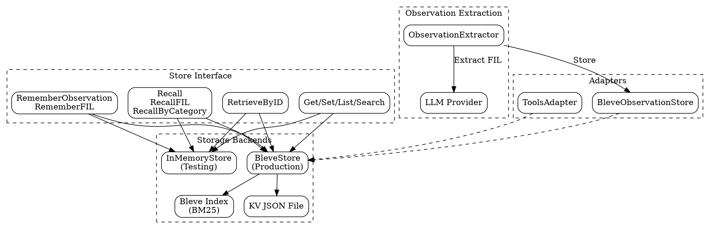

# Memory Package Design

## Overview

The memory package provides persistent semantic memory storage with BM25 full-text search for AI agents. It enables agents to remember observations (findings, insights, lessons) across sessions and retrieve them based on relevance to current context.

## Goals

| Goal | Description |
|------|-------------|
| Semantic recall | Retrieve relevant memories based on meaning, not just keywords |
| Knowledge persistence | Survive process restarts and session boundaries |
| Categorized storage | Organize knowledge as Findings, Insights, and Lessons (FIL) |
| Observation extraction | Automatically extract knowledge from agent step outputs |
| Backend agnostic | Single interface for testing (in-memory) and production (Bleve) |
| Scratchpad support | Simple key-value storage for transient working memory |

## Non-Goals

| Non-Goal | Reason |
|----------|--------|
| Vector embeddings | BM25 provides sufficient relevance; avoids embedding costs |
| Complex relationships | Not a knowledge graph; flat observation storage |
| Multi-agent sharing | Single-agent memory store; use state package for sharing |
| Versioning | No history tracking; observations are append-only |

## Core Types

### Memory

```go
// Memory represents a stored memory with metadata.
type Memory struct {
    ID        string    `json:"id"`
    Content   string    `json:"content"`
    Category  string    `json:"category"` // "finding" | "insight" | "lesson"
    Source    string    `json:"source"`   // "GOAL:step-name", "session:xyz", etc.
    CreatedAt time.Time `json:"created_at"`
}
```

### Observation (FIL Model)

```go
// Observation represents extracted observations from a step.
type Observation struct {
    // Findings: Factual discoveries (e.g., "API rate limit is 100/min")
    Findings []string `json:"findings,omitempty"`

    // Insights: Conclusions or inferences (e.g., "REST is better than GraphQL")
    Insights []string `json:"insights,omitempty"`

    // Lessons: Learnings for future (e.g., "Avoid library X - lacks TypeScript")
    Lessons []string `json:"lessons,omitempty"`

    StepName string `json:"step_name,omitempty"` // Source step identifier
    StepType string `json:"step_type,omitempty"` // GOAL, AGENT, RUN
}
```

### Store Interface

```go
type Store interface {
    // Observation storage (primary API)
    RememberObservation(ctx context.Context, content, category, source string) (string, error)
    RememberFIL(ctx context.Context, findings, insights, lessons []string, source string) ([]string, error)
    RetrieveByID(ctx context.Context, id string) (*ObservationItem, error)
    RecallByCategory(ctx context.Context, query, category string, limit int) ([]string, error)
    RecallFIL(ctx context.Context, query string, limitPerCategory int) (*FILResult, error)

    // Generic recall (returns all categories mixed)
    Recall(ctx context.Context, query string, opts RecallOpts) ([]MemoryResult, error)

    // Key-value operations (scratchpad)
    Get(key string) (string, error)
    Set(key, value string) error
    List(prefix string) ([]string, error)
    Search(query string) ([]SearchResult, error)

    // Session consolidation
    ConsolidateSession(ctx context.Context, sessionID string, transcript []Message) error

    // Lifecycle
    Close() error
}
```

### FILResult

```go
// FILResult holds categorized observation results.
type FILResult struct {
    Findings []string `json:"findings"`
    Insights []string `json:"insights"`
    Lessons  []string `json:"lessons"`
}
```

## Architecture



## BM25 Text Search (Bleve Integration)

The memory package uses [Bleve](https://blevesearch.com) for BM25 full-text search, providing relevance-ranked retrieval without requiring vector embeddings.

### Index Configuration

```go
// Document mapping for observations
obsMapping := bleve.NewDocumentMapping()

// Text field: analyzed for full-text search (tokenized, stemmed)
textFieldMapping := bleve.NewTextFieldMapping()
textFieldMapping.Analyzer = standard.Name
obsMapping.AddFieldMappingsAt("content", textFieldMapping)

// Keyword field: exact match only (category filtering)
keywordFieldMapping := bleve.NewKeywordFieldMapping()
obsMapping.AddFieldMappingsAt("category", keywordFieldMapping)
obsMapping.AddFieldMappingsAt("source", keywordFieldMapping)

// Date field: for time-based filtering
dateFieldMapping := bleve.NewDateTimeFieldMapping()
obsMapping.AddFieldMappingsAt("created_at", dateFieldMapping)
```

### Query Construction

Category-filtered search combines content matching with category filtering:

```go
// BM25 content match
contentQuery := bleve.NewMatchQuery(queryText)

// Category filter (exact match)
categoryQuery := bleve.NewTermQuery(category)
categoryQuery.SetField("category")

// Combined query
boolQuery := bleve.NewBooleanQuery()
boolQuery.AddMust(contentQuery)
boolQuery.AddMust(categoryQuery)
```

### Score Normalization

BM25 scores can exceed 1.0, so results are normalized:

```go
score := float32(hit.Score)
if score > 1 {
    score = 1 - (1 / (1 + score)) // Maps high scores to 0.5-1.0 range
}
```

## Observation Extraction and Categorization

### The FIL Model

Observations are categorized into three types:

| Category | Purpose | Examples |
|----------|---------|----------|
| **Findings** | Factual discoveries | "API rate limit is 100/min", "Auth uses OAuth2" |
| **Insights** | Conclusions/decisions | "REST is simpler than GraphQL for this use case" |
| **Lessons** | Future guidance | "Avoid library X - it lacks TypeScript support" |

### LLM-Based Extraction

The `ObservationExtractor` uses an LLM to extract structured observations from step outputs:

```go
extractor := NewObservationExtractor(llmProvider)

obs, err := extractor.Extract(ctx, "deploy-api", "GOAL", stepOutput)
// Returns: *Observation with populated Findings, Insights, Lessons
```

**Extraction behavior:**
- Skips outputs shorter than 50 characters
- Truncates outputs longer than 4000 characters
- Returns nil (not error) if extraction fails
- Handles JSON wrapped in markdown code blocks

### Extraction Prompt

The system prompt instructs the LLM to:
1. Identify factual discoveries as Findings
2. Extract conclusions and decisions as Insights  
3. Capture learnings for future as Lessons
4. Return only a JSON object with these arrays

## Storage Backends

### BleveStore (Production)

Persistent storage using Bleve index and JSON key-value file.

| Component | Storage | Purpose |
|-----------|---------|---------|
| `observations.bleve/` | Directory | Bleve index for BM25 search |
| `kv.json` | File | Key-value scratchpad |

**Configuration:**

```go
store, err := NewBleveStore(BleveStoreConfig{
    BasePath: "/path/to/storage",
})
```

**Features:**
- Thread-safe (RWMutex protected)
- Automatic index creation on first run
- Parallel category queries with WaitGroup
- Persistence across process restarts

### InMemoryStore (Testing)

Non-persistent implementation for unit tests.

| Feature | Implementation |
|---------|----------------|
| Observations | `map[string]*Memory` |
| KV store | `map[string]string` |
| Search | Simple substring matching with term counting |
| Persistence | None (data lost on Close) |

```go
store := NewInMemoryStore()
// Use in tests, data lost when test ends
```

## Adapters

### ToolsAdapter

Bridges `memory.Store` to the tools package interface:

```go
adapter := NewToolsAdapter(store)

// Tools package can now use memory features
ids, _ := adapter.RememberFIL(ctx, findings, insights, lessons, source)
results, _ := adapter.Recall(ctx, "query", 10)
```

### BleveObservationStore

Adapter for the executor package's observation storage interface:

```go
obsStore := NewBleveObservationStore(bleveStore)

// Store extracted observations
obsStore.StoreObservation(ctx, observation)

// Query relevant observations
results, _ := obsStore.QueryRelevantObservations(ctx, "query", 5)
```

## Package Structure

```
memory/
├── memory.go          # Store interface, core types, RecallOpts
├── observation.go     # Observation type, LLM extractor, BleveObservationStore
├── bleve_store.go     # BleveStore implementation (production)
├── bleve_store_test.go
├── inmemory.go        # InMemoryStore implementation (testing)
├── memory_test.go
└── adapter.go         # ToolsAdapter for tools package integration
```

## Usage Patterns

### Basic Observation Storage

```go
store, _ := NewBleveStore(BleveStoreConfig{BasePath: "./memory"})
defer store.Close()

ctx := context.Background()

// Store individual observations
id, _ := store.RememberObservation(ctx,
    "PostgreSQL version is 15.2",
    "finding",
    "GOAL:check-database",
)

// Store batch as FIL
ids, _ := store.RememberFIL(ctx,
    []string{"API uses OAuth2", "Rate limit is 100/min"},  // Findings
    []string{"REST is better for this use case"},          // Insights
    []string{"Always check rate limits first"},            // Lessons
    "GOAL:api-analysis",
)
```

### Semantic Recall

```go
// Recall all categories, ranked by relevance
results, _ := store.Recall(ctx, "database configuration", RecallOpts{
    Limit:    10,
    MinScore: 0.1,
})

for _, r := range results {
    fmt.Printf("[%s] %.2f: %s\n", r.Category, r.Score, r.Content)
}

// Recall specific category
findings, _ := store.RecallByCategory(ctx, "database", "finding", 5)

// Recall all categories as FIL structure
fil, _ := store.RecallFIL(ctx, "API integration", 5)
fmt.Printf("Findings: %v\n", fil.Findings)
fmt.Printf("Insights: %v\n", fil.Insights)
fmt.Printf("Lessons: %v\n", fil.Lessons)
```

### LLM Observation Extraction

```go
// Create extractor with LLM provider
extractor := NewObservationExtractor(llmProvider)

// Extract from step output
obs, err := extractor.Extract(ctx, "deploy-api", "GOAL", stepOutput)
if err != nil || obs == nil {
    return // Extraction failed or nothing to extract
}

// Store extracted observations
obsStore := NewBleveObservationStore(bleveStore)
obsStore.StoreObservation(ctx, obs)
```

### Session Consolidation

```go
// Extract insights from conversation transcript
transcript := []Message{
    {Role: "user", Content: "How should we handle auth?"},
    {Role: "assistant", Content: "We decided to use OAuth2 because..."},
}

store.ConsolidateSession(ctx, "session-123", transcript)
// Extracts messages containing decision language and stores as insights
```

### Key-Value Scratchpad

```go
// Store working data
store.Set("current_task", "implement-api")
store.Set("api.endpoint", "https://api.example.com")

// Retrieve
endpoint, _ := store.Get("api.endpoint")

// List by prefix
keys, _ := store.List("api.")  // Returns: ["api.endpoint"]

// Search across keys and values
results, _ := store.Search("example.com")
```

## Session Consolidation Heuristics

The `ConsolidateSession` method extracts insights using keyword detection:

| Trigger Words | Indication |
|---------------|------------|
| "decided", "conclusion" | Decision made |
| "important", "remember" | Key information |
| "note that", "key insight" | Explicit insight |
| "learned that" | Lesson learned |
| "will use", "should use", "agreed" | Choice made |

Additionally, the last assistant message over 100 characters is stored as a summary.

## Error Handling

| Error | Meaning | Recovery |
|-------|---------|----------|
| Index open failure | Corrupted Bleve index | Delete and recreate |
| Key not found | KV key doesn't exist | Expected for queries |
| Search failure | Query parsing error | Simplify query |
| Close failure | Index write error | Check disk space |

**Design principle:** Extraction and consolidation failures are non-fatal. The package returns `nil` rather than errors for graceful degradation.

## Testing Strategy

| Level | Focus |
|-------|-------|
| Unit | CRUD operations, recall relevance |
| Integration | Persistence across Close/Open |
| Concurrency | Thread safety of stores |
| Extraction | JSON parsing, markdown handling |

## Performance Considerations

| Operation | Complexity | Notes |
|-----------|------------|-------|
| RememberObservation | O(log n) | Bleve index insert |
| RecallByCategory | O(log n) | BM25 search |
| RecallFIL | O(log n) | Three parallel queries |
| KV Get/Set | O(1) | In-memory map |
| KV Search | O(n) | Linear scan |

**Optimization notes:**
- RecallFIL uses goroutines for parallel category queries
- BM25 provides good relevance without embedding overhead
- Semantic graph expansion was removed (hurt recall quality by diluting queries)
