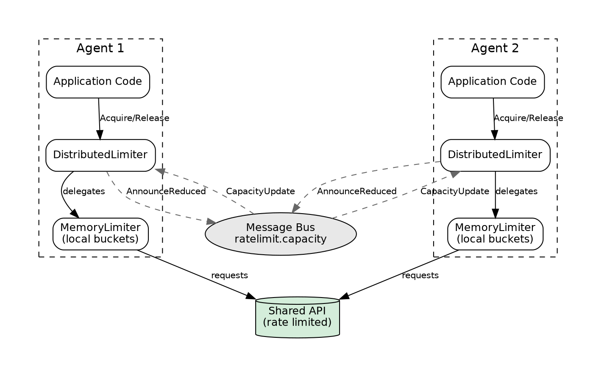
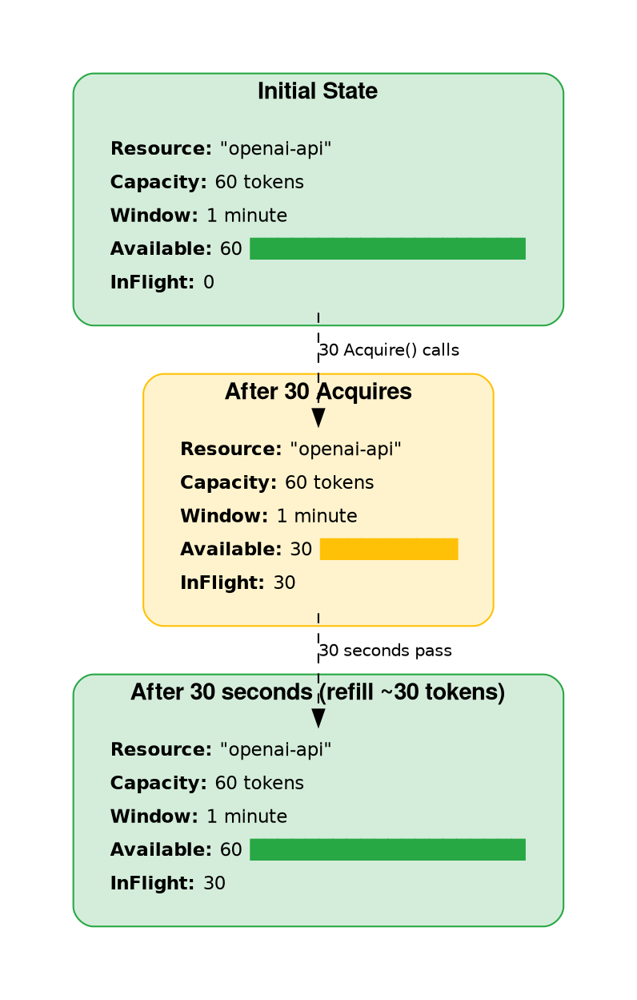
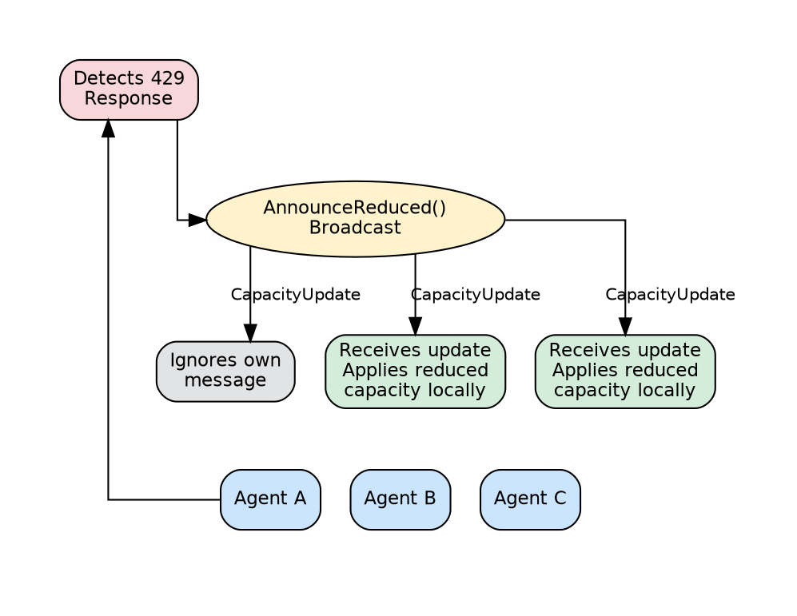

# Rate Limiter Design

## Overview

The ratelimit package provides rate limit coordination for shared resources across agent swarms. It implements token bucket rate limiting with both local and distributed modes, enabling multiple agents to safely share API quotas and resource capacity.

## Goals

| Goal | Description |
|------|-------------|
| Shared resource protection | Prevent agents from exceeding API rate limits |
| Distributed coordination | Synchronize capacity across agent swarms via message bus |
| Adaptive throttling | Automatically reduce capacity when limits are hit (429 responses) |
| Gradual recovery | Restore capacity over time after throttling events |
| Backend agnostic | Memory for testing, distributed for production |

## Non-Goals

| Non-Goal | Reason |
|----------|--------|
| Global token counting | Per-agent local buckets, not centralized counting |
| Exact fairness | Approximate distribution is sufficient |
| Persistence | Transient rate state; capacity config is ephemeral |
| Complex quotas | Fixed tokens/window only; no burst or tiered limits |

## Architecture



## Core Types

### RateLimiter Interface

```go
type RateLimiter interface {
    // Acquire blocks until a token is available for the resource.
    // Returns context.Canceled or context.DeadlineExceeded if context ends.
    // Returns ErrResourceUnknown if the resource has no configured capacity.
    Acquire(ctx context.Context, resource string) error

    // TryAcquire attempts to acquire a token without blocking.
    // Returns true if a token was acquired, false otherwise.
    TryAcquire(resource string) bool

    // Release returns a token to the resource bucket.
    // Optional; useful for tracking in-flight requests.
    Release(resource string)

    // SetCapacity configures the rate limit for a resource.
    // capacity is tokens per window; window is the refill period.
    SetCapacity(resource string, capacity int, window time.Duration)

    // AnnounceReduced broadcasts that capacity should be reduced.
    // For distributed limiters, notifies other agents.
    AnnounceReduced(resource string, reason string)

    // GetCapacity returns the current capacity info for a resource.
    GetCapacity(resource string) *Capacity

    // Close shuts down the limiter and releases resources.
    Close() error
}
```

### Capacity

```go
type Capacity struct {
    Resource  string        // Unique resource identifier
    Available int           // Current available tokens
    Total     int           // Maximum capacity (tokens per window)
    Window    time.Duration // Refill period
    InFlight  int           // Requests currently in progress
}
```

### CapacityUpdate

```go
type CapacityUpdate struct {
    Resource    string    `json:"resource"`     // Affected resource
    AgentID     string    `json:"agent_id"`     // Sender agent
    NewCapacity int       `json:"new_capacity"` // Suggested capacity
    Reason      string    `json:"reason"`       // Why reduced
    Timestamp   time.Time `json:"timestamp"`    // When sent
}
```

## Implementations

### MemoryLimiter

In-memory implementation using token buckets. Suitable for single-process scenarios and testing.

| Feature | Implementation |
|---------|----------------|
| Storage | `map[string]*bucket` with sync.Mutex |
| Refill | Time-based token addition on each access |
| Blocking | sync.Cond with periodic wake-up for context checks |
| Thread safety | All operations protected by mutex |

**Token Bucket Algorithm:**
- Tokens added at rate: `capacity / window`
- Each `Acquire` consumes one token
- `Release` returns a token for immediate reuse
- Refill calculated on-demand (lazy evaluation)

### DistributedLimiter

Coordinates rate limits across agents via the message bus. Wraps a MemoryLimiter for local token management.

| Feature | Implementation |
|---------|----------------|
| Local limiting | Delegates to embedded MemoryLimiter |
| Coordination | Subscribes to `ratelimit.capacity` subject |
| Reduction | Broadcasts capacity updates to swarm |
| Recovery | Background goroutine gradually restores capacity |

**Configuration:**

```go
type DistributedConfig struct {
    Bus              bus.MessageBus // Required: message bus for coordination
    AgentID          string         // Required: unique agent identifier
    ReduceFactor     float64        // Multiplier when reducing (default: 0.5)
    RecoveryInterval time.Duration  // How often to attempt recovery (default: 30s)
    RecoveryFactor   float64        // Multiplier when recovering (default: 1.1)
    MaxRecovery      bool           // Cap recovery at original capacity (default: true)
}
```

## Package Structure

```
ratelimit/
├── ratelimit.go       # Interface + types + errors
├── memory.go          # MemoryLimiter implementation
├── memory_test.go
├── distributed.go     # DistributedLimiter implementation
├── distributed_test.go
└── doc.go             # Package documentation
```

## Resource Management and Capacity

### Token Bucket Mechanics



### Capacity Configuration

```go
// Configure 60 requests per minute
limiter.SetCapacity("openai-api", 60, time.Minute)

// Configure 10 requests per second
limiter.SetCapacity("fast-api", 10, time.Second)

// Remove resource (capacity=0 or window=0)
limiter.SetCapacity("old-api", 0, time.Minute)
```

**Capacity Update Behavior:**
- New resource: Starts full (available = capacity)
- Existing resource: Updates limits, caps available if reduced
- Invalid values (≤0): Removes the resource

## Distributed Coordination via Bus

### Message Flow



### Subject Convention

All capacity updates use subject: `ratelimit.capacity`

### Update Processing Rules

1. **Ignore own updates** - Agents filter out messages with their own AgentID
2. **Only reduce, never increase** - Updates requesting higher capacity than original are ignored
3. **Unknown resources ignored** - Only affects resources already configured locally
4. **Callback notification** - Optional callback invoked for monitoring/logging

## Recovery Mechanics

### Gradual Capacity Recovery

After a reduction event, the DistributedLimiter automatically attempts to recover capacity:

```
Time 0:    Capacity reduced to 50 (from 100)
Time 30s:  Recovery attempt: 50 × 1.1 = 55
Time 60s:  Recovery attempt: 55 × 1.1 = 60
Time 90s:  Recovery attempt: 60 × 1.1 = 66
...
Time 240s: Recovery capped at 100 (original)
```

### Recovery Configuration

| Parameter | Default | Description |
|-----------|---------|-------------|
| `RecoveryInterval` | 30s | Time between recovery attempts |
| `RecoveryFactor` | 1.1 | Multiplier per recovery (10% increase) |
| `MaxRecovery` | true | Cap at original capacity |

### Recovery Flow

```go
func (d *DistributedLimiter) attemptRecovery() {
    for resource, lastReduce := range d.lastReduction {
        // Wait at least one interval
        if now.Sub(lastReduce) < d.config.RecoveryInterval {
            continue
        }
        
        // Gradually increase
        newCapacity := int(float64(current.Total) * d.config.RecoveryFactor)
        
        // Cap at original if MaxRecovery enabled
        if d.config.MaxRecovery && newCapacity > original {
            newCapacity = original
        }
        
        d.local.SetCapacity(resource, newCapacity, window)
    }
}
```

## Usage Patterns

### Basic Rate Limiting

```go
limiter := ratelimit.NewMemoryLimiter()
defer limiter.Close()

limiter.SetCapacity("api", 60, time.Minute) // 60 RPM

// Blocking acquire
if err := limiter.Acquire(ctx, "api"); err != nil {
    return err // context cancelled
}
defer limiter.Release("api")

// Make API call
response, err := client.Call(ctx)
```

### Non-blocking with Fallback

```go
if limiter.TryAcquire("api") {
    defer limiter.Release("api")
    return callPrimaryAPI()
}

// Fallback to secondary source
return callSecondaryAPI()
```

### Distributed Swarm Coordination

```go
limiter, err := ratelimit.NewDistributedLimiter(ratelimit.DistributedConfig{
    Bus:     messageBus,
    AgentID: agentID,
})
if err != nil {
    return err
}
defer limiter.Close()

// Set shared resource limit (each agent manages its own portion)
limiter.SetCapacity("shared-api", 100, time.Minute)

// Monitor capacity changes
limiter.OnCapacityChange(func(update *ratelimit.CapacityUpdate) {
    log.Printf("Capacity reduced by %s: %s (new: %d)",
        update.AgentID, update.Reason, update.NewCapacity)
})
```

### Handling 429 Responses

```go
resp, err := client.Call(ctx)
if err != nil {
    return err
}

if resp.StatusCode == 429 {
    // Announce to swarm that we hit the limit
    limiter.AnnounceReduced("api", "received 429 response")
    
    // Retry with backoff
    return retryWithBackoff(ctx, client)
}
```

### Tracking In-Flight Requests

```go
// Acquire tracks in-flight count
if err := limiter.Acquire(ctx, "api"); err != nil {
    return err
}

// Check current state
cap := limiter.GetCapacity("api")
log.Printf("In-flight: %d, Available: %d", cap.InFlight, cap.Available)

// Release when done (decrements in-flight, returns token)
defer limiter.Release("api")
```

### Timeout-Bounded Acquisition

```go
// Wait at most 5 seconds for a token
ctx, cancel := context.WithTimeout(context.Background(), 5*time.Second)
defer cancel()

if err := limiter.Acquire(ctx, "api"); err != nil {
    if err == context.DeadlineExceeded {
        return ErrRateLimited
    }
    return err
}
defer limiter.Release("api")
```

## Error Handling

| Error | Meaning | Recovery |
|-------|---------|----------|
| `ErrClosed` | Limiter has been closed | Reconnect or exit |
| `ErrResourceUnknown` | No capacity configured for resource | Call SetCapacity first |
| `ErrCapacityExhausted` | No tokens available (for future use) | Wait or use TryAcquire |
| `ErrInvalidCapacity` | Invalid capacity value | Fix configuration |
| `ErrInvalidWindow` | Invalid window duration | Fix configuration |
| `ErrInvalidConfig` | Missing Bus or AgentID | Provide required config |
| `context.Canceled` | Context was cancelled | Handle cancellation |
| `context.DeadlineExceeded` | Acquire timed out | Retry or fail gracefully |

## Best Practices

1. **Set capacity below actual limits** - Leave headroom for clock skew and bursty traffic
2. **Use Release for tracking** - Enables accurate in-flight monitoring
3. **Handle context cancellation** - Always check Acquire errors
4. **Monitor AnnounceReduced** - Log/alert when limits are hit
5. **Configure recovery appropriately** - Balance between safety and throughput
6. **Use TryAcquire for non-critical** - Fail fast instead of blocking

## Testing Strategy

| Level | Focus |
|-------|-------|
| Unit | Token bucket mechanics, refill timing |
| Integration | Multi-agent coordination via bus |
| Concurrency | Race conditions, mutex contention |
| Recovery | Gradual capacity restoration |
| Edge cases | Zero capacity, unknown resources, close during wait |
