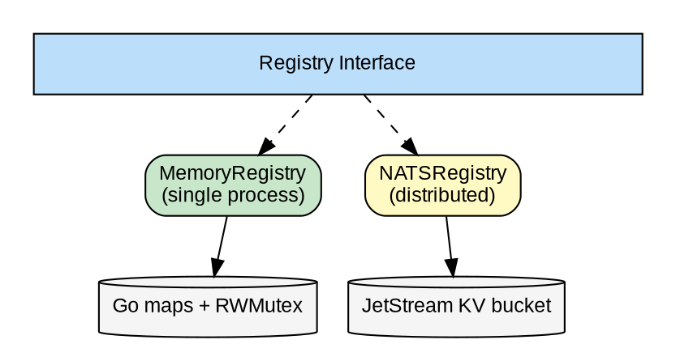
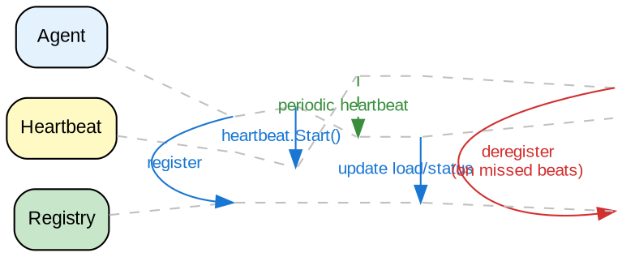

# Agent Registry Design

## Overview

The registry package provides agent registration and capability-based discovery for swarm coordination. Agents self-register with their capabilities, status, and load metrics. Other agents discover and select appropriate handlers based on requirements.

## Goals

| Goal | Description |
|------|-------------|
| Capability discovery | Find agents by what they can do |
| Load-aware selection | Route to least-loaded agents |
| Real-time updates | Watch for agent arrivals/departures |
| Backend agnostic | Memory for testing, NATS for production |
| TTL-based cleanup | Stale entries auto-expire |

## Non-Goals

| Non-Goal | Reason |
|----------|--------|
| Service mesh | Not a full service discovery system |
| Health checks | Use heartbeat package instead |
| Load balancing | Registry provides data; caller decides |
| Hierarchical namespaces | Flat capability model is simpler |

## Core Types

### AgentInfo

```go
type AgentInfo struct {
    ID           string            // Unique identifier
    Name         string            // Human-readable name
    Capabilities []string          // What the agent can do
    Status       Status            // Current state
    Load         float64           // Normalized load (0.0-1.0)
    Metadata     map[string]string // Additional key-value pairs
    LastSeen     time.Time         // Last registration update
}

type Status string
const (
    StatusIdle     Status = "idle"
    StatusBusy     Status = "busy"
    StatusRunning  Status = "running"
    StatusStopping Status = "stopping"
)
```

### Registry Interface

```go
type Registry interface {
    // Register adds or updates an agent in the registry.
    Register(info AgentInfo) error

    // Deregister removes an agent from the registry.
    Deregister(id string) error

    // Get retrieves a specific agent by ID.
    Get(id string) (*AgentInfo, error)

    // List returns all agents matching the optional filter.
    List(filter *Filter) ([]AgentInfo, error)

    // FindByCapability returns agents with a specific capability.
    // Results sorted by load (lowest first).
    FindByCapability(capability string) ([]AgentInfo, error)

    // Watch returns a channel of registry events.
    Watch() (<-chan Event, error)

    // Close shuts down the registry client.
    Close() error
}
```

### Filter

```go
type Filter struct {
    Status     Status  // Filter by state (empty = all)
    Capability string  // Filter by capability
    MaxLoad    float64 // Filter to agents at or below this load
}
```

### Events

```go
type EventType string
const (
    EventAdded   EventType = "added"
    EventUpdated EventType = "updated"
    EventRemoved EventType = "removed"
)

type Event struct {
    Type  EventType
    Agent AgentInfo
}
```

## Architecture



## Implementations

### MemoryRegistry

In-memory implementation for testing and single-node deployments.

| Feature | Implementation |
|---------|----------------|
| Storage | `map[string]AgentInfo` with RWMutex |
| TTL | Cleanup goroutine runs at `TTL/2` interval |
| Watch | Buffered channels, non-blocking sends |
| Thread safety | All operations use appropriate locks |

**Configuration:**
- `TTL` - Duration before agent considered stale (0 = never expires)

### NATSRegistry

Distributed implementation using NATS JetStream KV store.

| Feature | Implementation |
|---------|----------------|
| Storage | JetStream KV bucket (JSON-encoded AgentInfo) |
| TTL | Native KV TTL support |
| Watch | KV watcher with event translation |
| Replication | Configurable bucket replicas |

**Configuration:**
- `BucketName` - KV bucket name (default: "agent-registry")
- `TTL` - Entry expiry time
- `Replicas` - Number of replicas (1-5)

## Package Structure

```
registry/
├── registry.go    # Interface + types + helpers
├── memory.go      # MemoryRegistry implementation
├── memory_test.go
├── nats.go        # NATSRegistry implementation
├── nats_test.go
└── doc.go         # Package documentation
```

## Watch for Changes

Watchers receive events when agents are added, updated, or removed:

```go
events, err := registry.Watch()
if err != nil {
    return err
}

for event := range events {
    switch event.Type {
    case EventAdded:
        log.Printf("Agent joined: %s", event.Agent.ID)
    case EventUpdated:
        log.Printf("Agent updated: %s (load: %.2f)", 
            event.Agent.ID, event.Agent.Load)
    case EventRemoved:
        log.Printf("Agent left: %s", event.Agent.ID)
    }
}
```

**Event delivery:**
- Non-blocking sends (events dropped if channel full)
- Channel buffer size: 64 events
- Channel closed when registry closes

## Load-Aware Selection

`FindByCapability` returns agents sorted by load (lowest first):

```go
// Find code-review capable agents, sorted by load
agents, err := registry.FindByCapability("code-review")
if err != nil {
    return err
}

if len(agents) == 0 {
    return ErrNoAgentsAvailable
}

// Select least-loaded agent
target := agents[0]
```

**Selection strategies (caller's responsibility):**
- **Least loaded:** Always pick first (lowest load)
- **Random from N:** Pick random from top N lowest
- **Threshold:** Only consider agents below load threshold

## Usage Patterns

### Self-Registration

```go
// Agent startup
info := registry.AgentInfo{
    ID:           "agent-" + uuid.New().String(),
    Name:         "Code Reviewer",
    Capabilities: []string{"code-review", "lint", "test"},
    Status:       registry.StatusIdle,
    Load:         0.0,
}
registry.Register(info)

// Periodic update (typically with heartbeat)
info.Load = calculateLoad()
info.Status = currentStatus()
registry.Register(info)

// Agent shutdown
registry.Deregister(info.ID)
```

### Capability Discovery

```go
// Find agents that can handle code review
agents, _ := registry.FindByCapability("code-review")

// Find idle agents with low load
agents, _ := registry.List(&registry.Filter{
    Status:  registry.StatusIdle,
    MaxLoad: 0.5,
})
```

### Supervisor Pattern

```go
events, _ := registry.Watch()

for event := range events {
    if event.Type == registry.EventRemoved {
        // Agent died, reschedule its work
        rescheduleTasks(event.Agent.ID)
    }
}
```

## Integration with Heartbeat

Registry and heartbeat work together for liveness detection:



Typically:
- Heartbeat sender updates registry on each beat
- Heartbeat monitor deregisters dead agents

## Error Handling

| Error | Meaning | Recovery |
|-------|---------|----------|
| `ErrNotFound` | Agent ID not in registry | Expected for queries |
| `ErrClosed` | Registry has been closed | Reconnect or exit |
| `ErrInvalidID` | Empty agent ID | Fix caller code |
| `ErrDuplicateID` | ID collision (rare) | Use UUIDs |

## Testing Strategy

| Level | Focus |
|-------|-------|
| Unit | CRUD operations, filtering, event delivery |
| Integration | Multi-agent registration scenarios |
| Concurrency | Concurrent register/deregister |
| TTL | Expiry behavior, cleanup timing |
| Watch | Event ordering, channel behavior |
