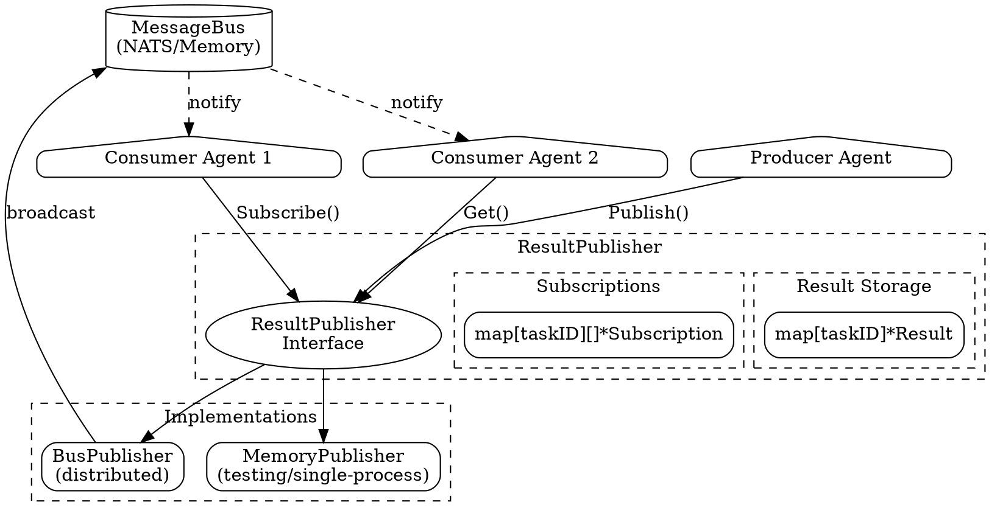
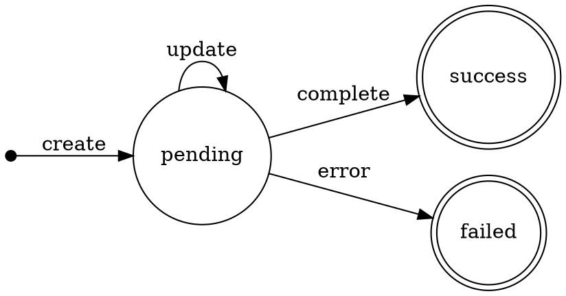
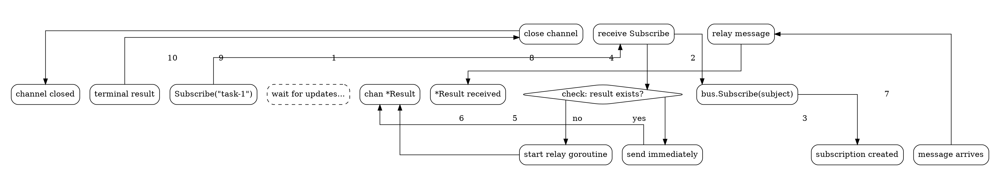

# Results Design

## Overview

The results package provides task result publication and subscription for agent coordination. It enables agents to publish task outputs to a shared store and allows other agents to subscribe to and retrieve results asynchronously. This decouples result production from consumption, enabling async task pipelines and distributed workflows.

## Goals

| Goal | Description |
|------|-------------|
| Async task coordination | Agents publish results; others subscribe without polling |
| Status tracking | Track task progression from pending to terminal states |
| Push-based updates | Subscribers receive updates as they happen |
| Backend agnostic | Memory for testing, bus-backed for distributed systems |
| Clean lifecycle | Results transition through well-defined states |

## Non-Goals

| Non-Goal | Reason |
|----------|--------|
| Result persistence | Use state package for durable storage |
| Result ordering | Results are independent; ordering is caller responsibility |
| Complex queries | Simple filtering only; use a database for complex queries |
| Result streaming | Single result per task; use bus for streaming data |

## Core Types

### Result

```go
type Result struct {
    // TaskID uniquely identifies the task.
    TaskID string

    // Status indicates the current state of the result.
    Status ResultStatus

    // Output contains the task's output data.
    // Empty for pending or failed tasks.
    Output []byte

    // Error contains the error message if Status is StatusFailed.
    Error string

    // Metadata contains additional key-value data about the result.
    Metadata map[string]string

    // CreatedAt is when the result was first created.
    CreatedAt time.Time

    // UpdatedAt is when the result was last updated.
    UpdatedAt time.Time
}
```

### ResultStatus

```go
type ResultStatus string

const (
    StatusPending ResultStatus = "pending"  // Task in progress
    StatusSuccess ResultStatus = "success"  // Task completed successfully
    StatusFailed  ResultStatus = "failed"   // Task failed
)

// Valid returns true if the status is a known value.
func (s ResultStatus) Valid() bool

// IsTerminal returns true if the status represents a final state.
func (s ResultStatus) IsTerminal() bool
```

### ResultPublisher Interface

```go
type ResultPublisher interface {
    // Publish stores or updates a task result.
    // If the result already exists, it is updated.
    Publish(ctx context.Context, taskID string, result Result) error

    // Get retrieves a result by task ID.
    // Returns ErrNotFound if the result doesn't exist.
    Get(ctx context.Context, taskID string) (*Result, error)

    // Subscribe returns a channel that receives updates for a task.
    // The channel is closed when the task reaches a terminal state
    // or when the subscription is cancelled.
    // If the result already exists, it is sent immediately.
    Subscribe(taskID string) (<-chan *Result, error)

    // List returns results matching the filter criteria.
    List(filter ResultFilter) ([]*Result, error)

    // Delete removes a result by task ID.
    // Returns ErrNotFound if the result doesn't exist.
    Delete(ctx context.Context, taskID string) error

    // Close shuts down the publisher and releases resources.
    Close() error
}
```

### ResultFilter

```go
type ResultFilter struct {
    Status        ResultStatus       // Filter by status (empty = all)
    TaskIDPrefix  string             // Filter by task ID prefix
    CreatedAfter  time.Time          // Results created after this time
    CreatedBefore time.Time          // Results created before this time
    Limit         int                // Max results (0 = unlimited)
    Metadata      map[string]string  // All pairs must match
}
```

## Architecture



## Result Lifecycle and Status Transitions

Results follow a simple state machine with pending as the initial state and success/failed as terminal states:



**State descriptions:**

| Status | Description | Terminal |
|--------|-------------|----------|
| `pending` | Task is in progress, may receive updates | No |
| `success` | Task completed successfully | Yes |
| `failed` | Task failed with error | Yes |

**Lifecycle behavior:**

1. **Create**: First `Publish()` creates result with `CreatedAt` timestamp
2. **Update**: Subsequent `Publish()` calls update result, preserving `CreatedAt`
3. **Terminal**: When status becomes terminal, all subscriptions auto-close
4. **Immutable after terminal**: Results can still be updated after terminal (e.g., adding metadata), but subscriptions won't reopen

## Implementations

### MemoryPublisher

In-memory implementation for testing and single-process scenarios.

| Feature | Implementation |
|---------|----------------|
| Storage | `map[string]*Result` with RWMutex |
| Subscriptions | `map[string][]*memorySub` with buffered channels |
| Notifications | Direct channel sends, non-blocking |
| Terminal handling | Closes all task subscriptions on terminal status |
| Buffer size | 16 messages per subscription |

**Use cases:** Unit tests, embedded agents, single-process pipelines

### BusPublisher

Distributed implementation using a message bus for notifications.

| Feature | Implementation |
|---------|----------------|
| Storage | Local `map[string]*Result` (each instance has own copy) |
| Notifications | Broadcasts via MessageBus |
| Subject format | `{prefix}.{taskID}` (default: `results.task-123`) |
| Relay goroutine | Forwards bus messages to local subscribers |
| Cache sync | Relayed messages update local result cache |

**Configuration:**

```go
type BusPublisherConfig struct {
    SubjectPrefix string  // Default: "results"
    BufferSize    int     // Default: 16
}
```

**Use cases:** Distributed agents, multi-process coordination, cross-network notification

## Subscription Model

### Subscribe Flow



### Subscription Behavior

| Scenario | Behavior |
|----------|----------|
| Subscribe before result exists | Channel waits, receives all updates |
| Subscribe after pending result | Immediate delivery, then updates |
| Subscribe to terminal result | Immediate delivery, channel closes |
| Multiple subscribers | Each gets independent channel |
| Publisher close | All subscription channels close |

### Auto-close on Terminal

Subscriptions automatically close when a terminal result is received:

```go
ch, _ := pub.Subscribe("task-123")
for result := range ch {
    fmt.Printf("Status: %s\n", result.Status)
    // Channel closes automatically when result.Status is terminal
}
// Loop exits when task completes
```

## Package Structure

```
results/
├── results.go       # Interface, Result, ResultStatus, ResultFilter, errors
├── memory.go        # MemoryPublisher implementation
├── bus.go           # BusPublisher implementation
├── results_test.go  # Comprehensive tests
└── doc.go           # Package documentation
```

## Usage Patterns

### Basic Publish and Get

```go
pub := results.NewMemoryPublisher()
defer pub.Close()

// Producer publishes result
err := pub.Publish(ctx, "task-123", results.Result{
    TaskID:   "task-123",
    Status:   results.StatusSuccess,
    Output:   []byte(`{"answer": 42}`),
    Metadata: map[string]string{"model": "gpt-4"},
})

// Consumer retrieves result
result, err := pub.Get(ctx, "task-123")
if err == results.ErrNotFound {
    // Task not complete yet
}
```

### Async Task Pipeline

```go
// Worker publishes progress
pub.Publish(ctx, taskID, results.Result{
    TaskID: taskID,
    Status: results.StatusPending,
    Metadata: map[string]string{"progress": "50%"},
})

// ... do work ...

// Publish final result
pub.Publish(ctx, taskID, results.Result{
    TaskID: taskID,
    Status: results.StatusSuccess,
    Output: outputData,
})
```

### Subscribe and Wait

```go
ch, err := pub.Subscribe("task-123")
if err != nil {
    return err
}

for result := range ch {
    switch result.Status {
    case results.StatusPending:
        log.Printf("Progress: %s", result.Metadata["progress"])
    case results.StatusSuccess:
        processOutput(result.Output)
        return nil  // Channel will close
    case results.StatusFailed:
        return errors.New(result.Error)
    }
}
```

### Filtering Results

```go
// Find all failed tasks from the batch
failed, err := pub.List(results.ResultFilter{
    TaskIDPrefix: "batch-2024-",
    Status:       results.StatusFailed,
    Limit:        100,
})

// Find recent pending tasks
pending, err := pub.List(results.ResultFilter{
    Status:       results.StatusPending,
    CreatedAfter: time.Now().Add(-1 * time.Hour),
})

// Filter by metadata
prod, err := pub.List(results.ResultFilter{
    Metadata: map[string]string{"env": "production"},
})
```

### Distributed Results with Bus

```go
// Create bus-backed publisher
nbus, _ := bus.NewNATSBus(bus.NATSConfig{URL: "nats://localhost:4222"})
pub := results.NewBusPublisher(nbus, results.BusPublisherConfig{
    SubjectPrefix: "agent.results",
    BufferSize:    32,
})
defer pub.Close()

// On Agent A: publish result
pub.Publish(ctx, "task-123", results.Result{
    TaskID: "task-123",
    Status: results.StatusSuccess,
    Output: outputData,
})

// On Agent B: receive notification via bus
ch, _ := pub.Subscribe("task-123")
result := <-ch  // Receives update from Agent A
```

### Error Result with Details

```go
pub.Publish(ctx, taskID, results.Result{
    TaskID: taskID,
    Status: results.StatusFailed,
    Error:  "API rate limit exceeded",
    Metadata: map[string]string{
        "retry_after": "60s",
        "attempt":     "3",
        "error_code":  "429",
    },
})
```

## Error Handling

| Error | Meaning | Recovery |
|-------|---------|----------|
| `ErrNotFound` | Result doesn't exist | Wait and retry, or subscribe |
| `ErrAlreadyExists` | (Reserved for future use) | — |
| `ErrClosed` | Publisher has been closed | Create new publisher |
| `ErrInvalidTaskID` | Empty task ID | Validate before calling |
| `ErrInvalidStatus` | Unknown status value | Use defined constants |

### Validation Functions

```go
// Validate task ID
if err := results.ValidateTaskID(taskID); err != nil {
    return err  // ErrInvalidTaskID
}

// Validate complete result
if err := results.ValidateResult(result); err != nil {
    return err  // ErrInvalidTaskID or ErrInvalidStatus
}
```

## Thread Safety

- All operations are goroutine-safe
- Results are cloned on read/write to prevent external mutation
- Subscriptions use buffered channels with non-blocking sends
- Atomic flags track closed state

## Testing Strategy

| Level | Focus |
|-------|-------|
| Unit | Status validation, filter matching, result cloning |
| Integration | Publish/subscribe flows, terminal handling |
| Concurrency | Concurrent publishes, multiple subscribers |
| Error paths | Invalid inputs, closed publisher |
| Bus integration | Cross-publisher notification |
