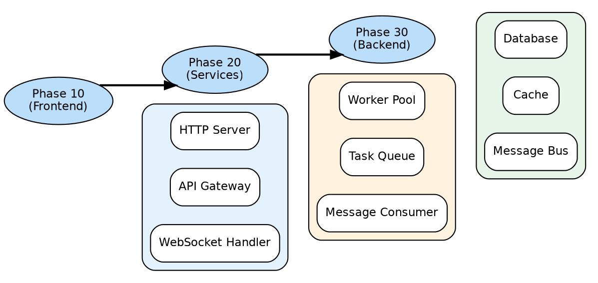
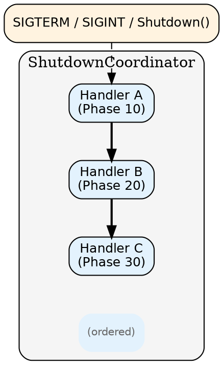
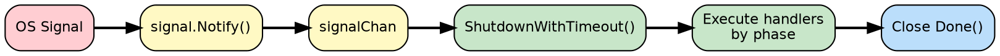

# Shutdown Coordination Design

## What This Package Does

The `shutdown` package manages graceful shutdown for agents. When an agent receives a termination signal (Ctrl+C, SIGTERM), this package ensures in-progress work completes, resources are released, and the system exits cleanly.

## Why It Exists

Abrupt termination causes problems:

- **Lost work** — Tasks in progress are abandoned mid-execution
- **Corrupted state** — Files and databases may be left inconsistent
- **Resource leaks** — Connections and locks aren't released
- **Downstream failures** — Other agents waiting on responses never get them

Graceful shutdown solves these by giving components time to finish what they're doing before the process exits.

## When to Use It

**Use shutdown coordination for:**
- Any long-running agent process
- Agents that handle stateful tasks
- Systems where work must complete or be safely re-queued
- Production deployments (Kubernetes sends SIGTERM before killing pods)

**You don't need this for:**
- Short-lived scripts
- Stateless request handlers (if a request dies, client retries)
- Development/testing (though it's still good practice)

## Core Concepts

### Shutdown Handlers

Components that need cleanup register a **shutdown handler**. When shutdown begins, the coordinator calls each handler, giving it time to finish gracefully.

A handler might:
- Stop accepting new requests
- Finish in-progress tasks
- Re-queue pending work for other agents
- Close database connections
- Flush logs

### Phases

Not all components can shut down simultaneously. A worker processing tasks needs the database connection to stay open. The database can't close until workers are done.

**Phases** solve this ordering problem. Lower phase numbers shut down first:

- **Phase 10** — Stop accepting work (HTTP servers, registries)
- **Phase 20** — Drain in-flight work (task processors, message handlers)
- **Phase 30** — Close backends (databases, message bus, caches)

Handlers in the same phase run concurrently. The coordinator waits for all handlers in a phase to complete before starting the next phase.

### Timeouts

Shutdown can't wait forever. A **timeout** ensures the process eventually exits, even if a handler hangs. When the timeout expires, remaining handlers are cancelled and the process terminates.

Typical timeouts: 30-60 seconds. Long enough for normal cleanup, short enough to not delay deployments.

## Architecture

The coordinator:
1. Receives shutdown signal (SIGTERM, SIGINT, or programmatic trigger)
2. Groups handlers by phase
3. Executes each phase sequentially
4. Waits for all handlers in a phase before proceeding
5. Enforces timeout across the entire shutdown
6. Reports results (success, errors, timing)

## Signal Handling

The coordinator can automatically handle OS signals:

- **SIGTERM** — Sent by process managers (Kubernetes, systemd) before killing
- **SIGINT** — Sent when user presses Ctrl+C

When a signal arrives, the coordinator starts graceful shutdown with the configured timeout.

## Error Handling

### Handler Errors

If a handler fails, the coordinator can either:
- **Continue** (default) — Execute remaining handlers, collect errors
- **Stop** — Abort shutdown, skip remaining handlers

Continuing is usually better — you want to clean up as much as possible even if one component has problems.

### Timeout Exceeded

If shutdown takes longer than the timeout:
- All pending handlers receive context cancellation
- Handlers should check for cancellation and exit promptly
- The coordinator returns a timeout error

Well-behaved handlers check context cancellation frequently and return quickly when cancelled.

## Common Patterns

### Stop-Drain-Close

The most common pattern:

1. **Stop** (phase 10) — Stop accepting new work
2. **Drain** (phase 20) — Finish in-progress work
3. **Close** (phase 30) — Release resources

This ensures no new work arrives while draining, and backends stay available until work is done.

### Progress Logging

Configure a progress callback to log each handler's completion. This helps diagnose slow or stuck handlers in production.

### Re-queue Before Exit

Task processors should re-queue unfinished work before completing shutdown. This ensures tasks aren't lost — another agent can pick them up.

### Deregister Early

Remove the agent from the registry early in shutdown (phase 10). This stops new work being assigned while the agent is shutting down.

## Integration with Other Packages

| Package | Shutdown Integration |
|---------|---------------------|
| Transport | Close connections, stop accepting requests (phase 10) |
| Bus | Close after message handlers finish (phase 30) |
| Registry | Deregister early to stop receiving work (phase 10) |
| State | Close after everything using it (phase 30) |
| Heartbeat | Stop sending before exit (any phase) |

## Design Decisions

### Why phases instead of dependencies?

Explicit dependencies create complex graphs. Phases are simpler — just pick a number. Most systems only need 3-4 phases. If you need more granularity, use intermediate numbers (15, 25).

### Why concurrent within phase?

Independent components can shut down simultaneously. Running them concurrently reduces total shutdown time. Only the ordering between phases matters.

### Why continue on error by default?

Partial cleanup is better than no cleanup. If the HTTP server fails to close, you still want to flush logs and close the database.

## Best Practices

| Practice | Rationale |
|----------|-----------|
| Always set a timeout | Prevent indefinite hangs |
| Check context cancellation | Allow graceful timeout handling |
| Re-queue unfinished work | Prevent work loss |
| Use explicit phases | Make dependencies obvious |
| Log shutdown progress | Aid production debugging |
| Test shutdown paths | They're often neglected |

## Testing Strategy

| Level | Focus |
|-------|-------|
| Unit | Phase ordering, timeout enforcement |
| Integration | Full shutdown with real components |
| Timeout | Handlers that exceed timeout |
| Error | Handlers that fail, error modes |
| Signal | SIGTERM/SIGINT handling |
