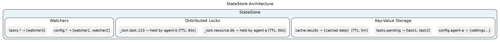
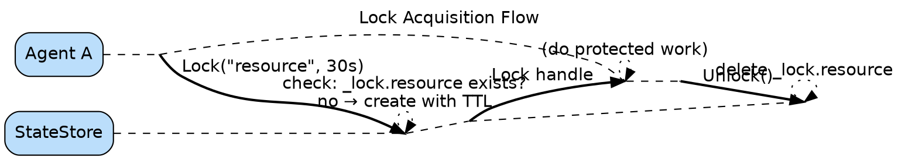
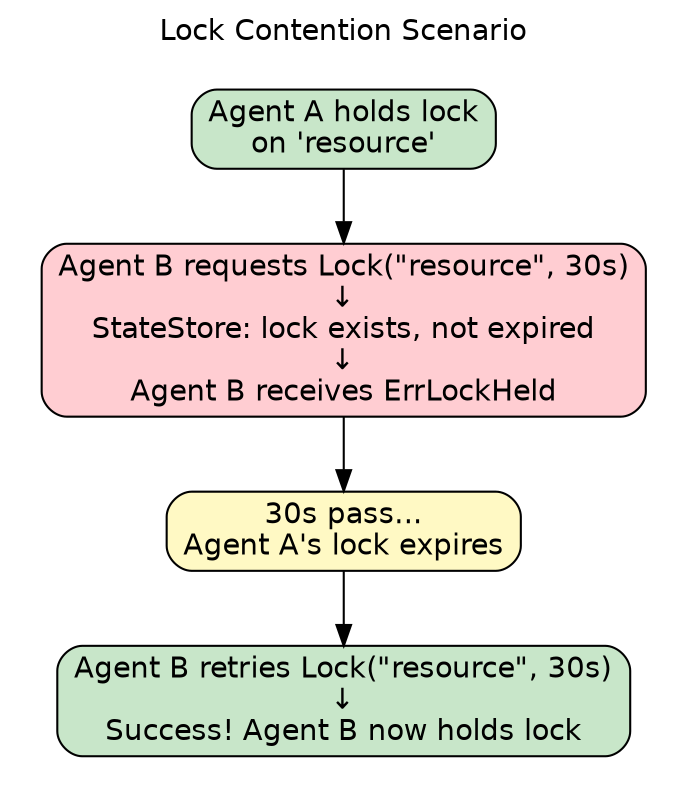
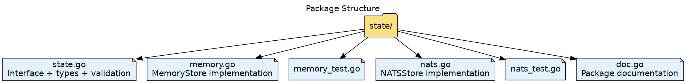

# Shared State Design

## What This Package Does

The `state` package provides a shared key-value store that multiple agents can read from and write to. Think of it as a shared scratchpad where agents can:

- Store and retrieve data by key
- Set expiration times so data auto-cleans
- Watch for changes in real-time
- Use locks to prevent race conditions

## Why It Exists

In a swarm, agents need to share information:

- **Configuration** — One agent updates settings, others pick up the change
- **Task coordination** — Agents claim work items without stepping on each other
- **Caching** — Expensive computation results shared across agents
- **Leader election** — Only one agent acts as coordinator at a time

Without shared state, agents would duplicate work, conflict with each other, or need complex point-to-point messaging.

## When to Use It

**Use state for:**
- Small pieces of data (configs, flags, task claims)
- Data that needs TTL (caches, temporary locks)
- Coordination between agents (locks, leader election)

**Don't use state for:**
- Large datasets — use a proper database
- Complex queries — this is key-value only
- Message passing — use the `bus` package instead

## Core Concepts

### Keys and Values

Data is stored as key-value pairs. Keys are strings (like `config.timeout` or `task.abc123`). Values are opaque bytes — you decide the format (JSON, protobuf, plain text).

Keys support hierarchical naming with dots: `config.agent-pool.timeout`. This enables pattern matching when watching for changes.

### Time-to-Live (TTL)

Every entry can have an optional TTL. When the TTL expires, the entry is automatically deleted. This is essential for:

- **Caches** — Don't manually clean up stale data
- **Locks** — Prevent deadlocks if an agent crashes while holding a lock
- **Temporary state** — Session data, in-progress markers

If you don't set a TTL (or set it to zero), the entry lives forever until explicitly deleted.

### Revisions

Each key has a revision number that increments on every change. This enables:

- **Optimistic locking** — "Update only if revision is still X"
- **Change detection** — "Has this key changed since I last read it?"

### Watching

You can watch for changes to keys matching a pattern. The store pushes notifications when keys are created, updated, or deleted. This enables reactive patterns — respond to changes instead of polling.

## Architecture

The `StateStore` interface has two implementations:

**MemoryStore** — In-memory storage for testing and single-process use. All data lives in Go maps protected by mutexes. A background goroutine cleans up expired entries.

**NATSStore** — Production implementation using NATS JetStream. Data is replicated across the NATS cluster for high availability. Supports the same interface but with network-level distribution.

## Distributed Locking

Locks prevent multiple agents from modifying the same resource simultaneously.

### How Locking Works

1. Agent requests a lock on a key with a TTL
2. Store checks if lock already exists
3. If free, store creates the lock and returns a handle
4. Agent does protected work
5. Agent releases the lock

The TTL is critical: if an agent crashes while holding a lock, the lock automatically expires. Without TTL, a crashed agent would leave resources locked forever.

### Lock Contention

When two agents try to lock the same resource:

1. First agent wins, gets the lock
2. Second agent receives "lock held" error
3. Second agent can retry with backoff, or do something else

### Lock Best Practices

- **Always set a TTL** — 30 seconds to a few minutes depending on operation length
- **Refresh for long operations** — If work takes longer than TTL, periodically refresh the lock
- **Release promptly** — Don't hold locks longer than needed
- **Handle contention gracefully** — Expect locks to fail sometimes

## Watch Patterns

Watching enables event-driven architectures where agents react to state changes.

### Pattern Syntax

- `*` — Watch all keys
- `prefix.*` — Watch keys starting with "prefix."

### Delivery Guarantees

- Events are buffered (typically 64 events)
- If buffer fills, oldest events may be dropped
- Order is preserved per key
- Channel closes when store closes

## Error Scenarios

| Situation | What Happens | What to Do |
|-----------|--------------|------------|
| Key doesn't exist | Get returns "not found" | Expected — check existence first or handle gracefully |
| Store closed | All operations fail | Reconnect or shut down |
| Lock already held | Lock returns error | Retry with backoff or skip |
| Lock expired | Refresh fails | Re-acquire if needed |
| Network partition (NATS) | Operations may timeout | Retry with backoff |

## Common Patterns

### Configuration Distribution

One agent (or external system) writes configuration. Other agents watch for changes and reload automatically. No polling, no restarts needed.

### Work Queue with Claims

Tasks are stored as keys. Workers try to lock a task before processing. Only one worker succeeds; others move on. When done, worker deletes the task and releases the lock.

### Leader Election

All agents try to acquire the same lock. One succeeds and becomes leader. Leader refreshes lock periodically. If leader crashes, lock expires and another agent takes over.

### Caching with Auto-Expiry

Store expensive computation results with TTL. On cache miss, compute and store. Stale entries expire automatically — no cleanup code needed.

## Package Structure

## Testing Strategy

| Level | Focus |
|-------|-------|
| Unit | Basic CRUD, pattern matching, TTL behavior |
| Integration | Multi-agent state sharing via NATS |
| Locking | Contention scenarios, TTL expiry, refresh |
| Watch | Event delivery, pattern filtering, channel behavior |
| Failure | Network issues, store closure, recovery |
