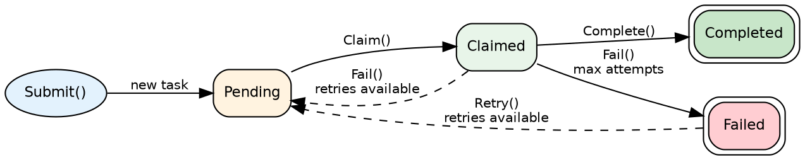
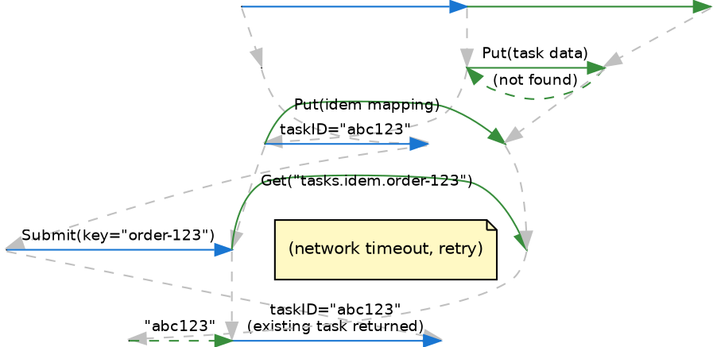
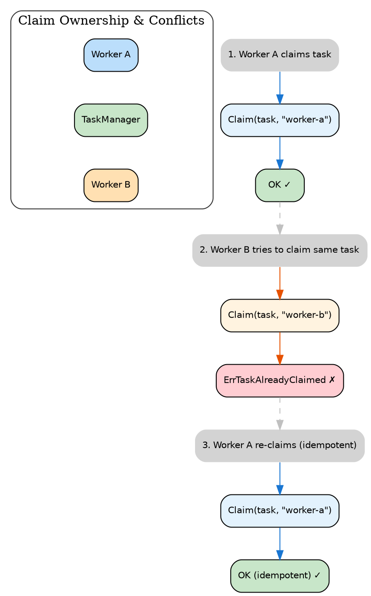
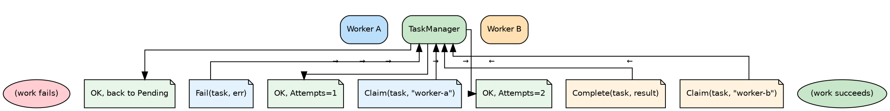
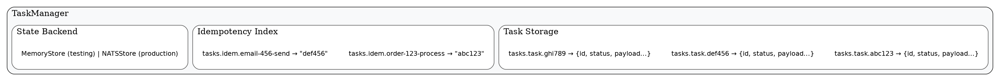

# Tasks Design

## What This Package Does

The `tasks` package provides idempotent task handling with deduplication. It ensures that submitting the same task twice doesn't create duplicate work, and that tasks can safely retry when they fail.

## Why It Exists

Distributed systems have a fundamental problem: messages can be delivered more than once. A coordinator might send a task, not receive an acknowledgment (network blip), and send it again. Without deduplication, the task runs twice.

This package solves that with **idempotency keys**. Each task has a unique key. If you submit a task with a key that already exists, you get back the existing task instead of creating a duplicate.

It also handles the claim/complete workflow: workers claim tasks, process them, and mark them done. If a worker crashes mid-processing, the task can be retried by another worker.

## When to Use It

**Use tasks for:**
- Work that must run exactly once (sending emails, processing payments)
- Work that needs retry on failure
- Coordinating work across multiple workers
- Tracking task status and results

**Don't use tasks for:**
- Fire-and-forget notifications (use `bus`)
- Real-time messaging (too much overhead)
- Simple key-value storage (use `state` directly)

## Core Concepts

### Task Lifecycle

A task moves through four states:

1. **Pending** — Waiting for a worker to claim it
2. **Claimed** — A worker is processing it
3. **Completed** — Successfully finished
4. **Failed** — Permanently failed (exhausted retries)

### Idempotency Keys

Every task has an **idempotency key** — a string that uniquely identifies the work. When you submit a task, the system first checks if a task with that key exists:

- If yes, return the existing task (no duplicate created)
- If no, create the new task

Good idempotency keys include:
- The entity being acted on (`order-123`)
- The action being performed (`send-confirmation`)
- Combined: `order-123-send-confirmation`

Avoid timestamps or random values — retries would generate different keys and defeat deduplication.

### Claim Ownership

Before processing a task, a worker must **claim** it. Claiming:
- Marks the task as in-progress
- Records which worker has it
- Prevents other workers from grabbing it

Only the claiming worker can complete or fail the task. This prevents race conditions where two workers process the same task.

### Retry Logic

Tasks can specify a maximum number of attempts. When a worker fails a task:
- If retries remain, the task returns to pending for another worker
- If retries are exhausted, the task moves to failed permanently

This enables automatic retry without manual intervention.

## Architecture

The task manager stores tasks in the state backend (memory or NATS). Two types of keys:

- **Task data** (`tasks.task.{id}`) — The full task record
- **Idempotency mapping** (`tasks.idem.{key}`) — Maps idempotency key to task ID

The idempotency check is atomic — even concurrent submissions with the same key won't create duplicates.

## Common Patterns

### Producer/Consumer

A coordinator submits tasks. Multiple workers compete to claim and process them. Each task goes to exactly one worker.

### Safe Retry

Network errors? Submit again with the same idempotency key. If the task already exists, you get back its status. If it doesn't, a new one is created. Either way, no duplicate work.

### Status Tracking

After submitting a task, you can check its status by ID or idempotency key. When it completes, the result is stored on the task record.

### Cleanup

Completed and failed tasks stay in storage indefinitely. Periodically delete old ones to prevent unbounded growth.

## Error Scenarios

| Situation | What Happens | What to Do |
|-----------|--------------|------------|
| Duplicate submission | Returns existing task ID | Expected behavior |
| Another worker claimed it | Claim returns error | Skip, try another task |
| Worker crashes while processing | Task stays claimed | External process calls retry |
| Max attempts exhausted | Task moves to failed | Manual intervention needed |
| Storage unavailable | Operations fail | Retry with backoff |

## Design Decisions

### Why claim before process?

Claiming provides exclusive access. Without it, two workers might grab the same task from a pending list and both process it.

### Why no automatic claim expiry?

Simplicity. Automatic expiry requires background goroutines and timing complexity. For now, crashed workers need external recovery (a supervisor calling retry).

### Why store results on tasks?

Callers often want to know: did it succeed? what was the result? Storing results on the task record makes this a simple lookup instead of a separate storage system.

## Integration Notes

### With Bus

Use the bus to notify workers when new tasks arrive. Workers subscribe to a topic, receive notifications, then claim tasks from the task manager.

### With State

The task manager uses the state package for persistence. Memory store for testing, NATS store for production.

### With Shutdown

During graceful shutdown, workers should either:
- Complete in-progress tasks quickly
- Call fail on tasks they can't finish (so another worker can retry)

## Testing Strategy

| Level | Focus |
|-------|-------|
| Unit | CRUD operations, state transitions |
| Idempotency | Duplicate submission handling |
| Concurrency | Multiple workers claiming same task |
| Retry | Attempt counting, exhaustion |
| Lifecycle | Full pending → claimed → completed flow |
