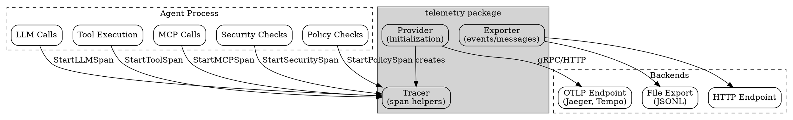

# Telemetry Design

## Overview

The telemetry package provides observability for agent workflows through OpenTelemetry integration and event export. It enables distributed tracing across LLM calls, tool executions, MCP interactions, and security checks—giving operators visibility into agent behavior and performance.

## Goals

| Goal | Description |
|------|-------------|
| OpenTelemetry native | First-class OTLP export for tracing backends (Jaeger, Tempo, etc.) |
| Agent-specific spans | Pre-built span types for LLM, tools, MCP, security, and policy |
| Debug mode | Optional content capture for troubleshooting (disabled by default) |
| Flexible export | HTTP, file, and noop exporters for different environments |
| Context propagation | Cross-process trace context for distributed agent systems |
| Privacy-aware | Content only logged in debug mode to protect user data |

## Non-Goals

| Non-Goal | Reason |
|----------|--------|
| Metrics collection | Focus on tracing; use OpenTelemetry metrics directly |
| Log aggregation | Use structured logging packages instead |
| APM features | Backend-specific; keep exporter simple |
| Auto-instrumentation | Explicit spans preferred for control |

## Architecture



## Core Types

### ProviderConfig

Configuration for OpenTelemetry provider initialization:

```go
type ProviderConfig struct {
    // ServiceName is the name of the service (required).
    ServiceName string

    // ServiceVersion is the version of the service.
    ServiceVersion string

    // Endpoint is the OTLP endpoint (e.g., "localhost:4317").
    // If empty, uses OTEL_EXPORTER_OTLP_ENDPOINT env var.
    Endpoint string

    // Protocol is "grpc" or "http". Default is "grpc".
    Protocol string

    // Insecure disables TLS. Default is false.
    Insecure bool

    // Debug enables content in span attributes.
    Debug bool

    // Headers are additional headers to send with requests.
    Headers map[string]string

    // BatchTimeout is the maximum time to wait before sending a batch.
    BatchTimeout time.Duration

    // ExportTimeout is the timeout for exporting spans.
    ExportTimeout time.Duration
}
```

### Tracer

Wraps OpenTelemetry tracing with agent-specific helpers:

```go
type Tracer struct {
    tracer trace.Tracer
    debug  bool // When true, include content in span attributes
}
```

### Message

Represents an LLM interaction for event export:

```go
type Message struct {
    SessionID    string                 `json:"session_id"`
    WorkflowName string                 `json:"workflow_name"`
    Goal         string                 `json:"goal"`
    Role         string                 `json:"role"`
    Agent        string                 `json:"agent,omitempty"`
    Content      string                 `json:"content"`
    ToolCalls    []interface{}          `json:"tool_calls,omitempty"`
    Tokens       TokenCount             `json:"tokens"`
    Latency      time.Duration          `json:"latency"`
    Model        string                 `json:"model"`
    Iteration    int                    `json:"iteration,omitempty"`
    Timestamp    time.Time              `json:"timestamp"`
    Extra        map[string]interface{} `json:"extra,omitempty"`
}

type TokenCount struct {
    Input  int `json:"input"`
    Output int `json:"output"`
}
```

## Provider Initialization

### Basic Setup

```go
ctx := context.Background()

provider, err := telemetry.InitProvider(ctx, telemetry.ProviderConfig{
    ServiceName:    "my-agent",
    ServiceVersion: "1.0.0",
    Endpoint:       "localhost:4317",
    Protocol:       "grpc",
    Insecure:       true,
    Debug:          false,
})
if err != nil {
    log.Fatal(err)
}
defer provider.Shutdown(ctx)

// Get tracer for creating spans
tracer := provider.Tracer()
```

### Environment Variable Configuration

The provider respects standard OpenTelemetry environment variables:

| Variable | Description | Default |
|----------|-------------|---------|
| `OTEL_EXPORTER_OTLP_ENDPOINT` | OTLP endpoint | (required) |
| `OTEL_SERVICE_NAME` | Service name | "agent" |

```go
// Uses environment variables
provider, err := telemetry.InitProvider(ctx, telemetry.ProviderConfig{
    // Endpoint and ServiceName read from env
    Protocol: "grpc",
    Insecure: true,
})
```

## OTLP Export

### gRPC Protocol (Default)

```go
provider, _ := telemetry.InitProvider(ctx, telemetry.ProviderConfig{
    ServiceName: "agent",
    Endpoint:    "otel-collector:4317",
    Protocol:    "grpc",
    Insecure:    true, // For local development
})
```

### HTTP Protocol

```go
provider, _ := telemetry.InitProvider(ctx, telemetry.ProviderConfig{
    ServiceName: "agent",
    Endpoint:    "otel-collector:4318",
    Protocol:    "http",
    Headers: map[string]string{
        "Authorization": "Bearer " + token,
    },
})
```

### Production Configuration

```go
provider, _ := telemetry.InitProvider(ctx, telemetry.ProviderConfig{
    ServiceName:    "production-agent",
    ServiceVersion: version,
    Endpoint:       "otel.example.com:4317",
    Protocol:       "grpc",
    Insecure:       false, // TLS enabled
    Headers: map[string]string{
        "x-api-key": apiKey,
    },
    BatchTimeout:  5 * time.Second,
    ExportTimeout: 30 * time.Second,
})
```

## Span Types for Agent Workflows

### LLM Spans

Track LLM API calls with token counts and optional content:

```go
ctx, span := tracer.StartLLMSpan(ctx, "llm.completion")

// Make LLM call...
response, err := llm.Complete(ctx, prompt)

tracer.EndLLMSpan(span, telemetry.LLMSpanOptions{
    Model:     "claude-3-opus",
    Provider:  "anthropic",
    TokensIn:  1500,
    TokensOut: 800,
    Prompt:    prompt,    // Only included if debug=true
    Response:  response,  // Only included if debug=true
}, err)
```

**Span attributes:**
- `llm.model` - Model identifier
- `llm.provider` - Provider name (anthropic, openai, etc.)
- `llm.tokens.input` - Input token count
- `llm.tokens.output` - Output token count
- `llm.prompt` - Prompt text (debug only, truncated to 4000 chars)
- `llm.response` - Response text (debug only, truncated to 4000 chars)
- `llm.thinking` - Chain-of-thought (debug only, truncated to 4000 chars)

### Tool Spans

Track tool execution within agent workflows:

```go
ctx, span := tracer.StartToolSpan(ctx, "file.read")

// Execute tool...
result, err := tool.Execute(ctx, args)

tracer.EndToolSpan(span, telemetry.ToolSpanOptions{
    Tool:   "file.read",
    Args:   map[string]interface{}{"path": "/data/input.txt"},
    Result: result, // Only included if debug=true
}, err)
```

**Span attributes:**
- `tool.name` - Tool identifier
- `tool.arg.*` - Tool arguments (always included, truncated to 500 chars)
- `tool.result` - Execution result (debug only, truncated to 4000 chars)

### MCP Spans

Track Model Context Protocol tool calls to external servers:

```go
ctx, span := tracer.StartMCPSpan(ctx, "github", "create_issue")

// Call MCP server...
result, err := mcpClient.Call(ctx, "create_issue", args)

tracer.EndMCPSpan(span, telemetry.MCPSpanOptions{
    Server: "github",
    Tool:   "create_issue",
    Args:   args,
    Result: result, // Only included if debug=true
}, err)
```

**Span attributes:**
- `mcp.server` - MCP server name
- `mcp.tool` - Tool name
- `mcp.arg.*` - Tool arguments
- `mcp.result` - Result (debug only)

### Security Spans

Track security check flows:

```go
ctx, span := tracer.StartSecuritySpan(ctx, "content_check")

// Run security checks...
verdict, err := security.Check(ctx, content)

tracer.EndSecuritySpan(span, telemetry.SecuritySpanOptions{
    CheckPath: "static→triage→supervisor",
    Verdict:   "allow",
    BlockID:   "",
    Flags:     []string{"checked_pii", "checked_secrets"},
    Prompt:    content,  // Only in debug mode
    Response:  response, // Only in debug mode
}, err)
```

**Span attributes:**
- `security.check_path` - Flow path (static, static→triage, etc.)
- `security.verdict` - allow, deny, or modify
- `security.block_id` - Block ID if denied
- `security.flags` - Security flags applied
- `security.prompt` / `security.response` - Content (debug only)

### Policy Spans

Track policy enforcement decisions:

```go
ctx, span := tracer.StartPolicySpan(ctx, "exec_check")

// Check policy...
allowed, reason := policy.Check(ctx, command)

tracer.EndPolicySpan(span, telemetry.PolicySpanOptions{
    Step:    "deterministic",
    Allowed: allowed,
    Reason:  reason,
    Command: command, // Only in debug mode
}, err)
```

**Span attributes:**
- `policy.step` - deterministic or llm
- `policy.allowed` - Boolean result
- `policy.reason` - Denial reason
- `policy.command` - Command checked (debug only)

## Event Exporters

For simpler event/message logging without full OpenTelemetry:

### Exporter Interface

```go
type Exporter interface {
    LogEvent(name string, data map[string]interface{})
    LogMessage(msg Message)
    Flush() error
    Close() error
}
```

### HTTP Exporter

Batches and sends telemetry to an HTTP endpoint:

```go
exporter := telemetry.NewHTTPExporter("https://telemetry.example.com/ingest")
defer exporter.Close()

exporter.LogEvent("workflow.started", map[string]interface{}{
    "workflow": "analyze",
    "goal":     "Review PR #123",
})

exporter.LogMessage(telemetry.Message{
    SessionID:    "sess-abc",
    WorkflowName: "analyze",
    Role:         "assistant",
    Content:      "I'll review the pull request...",
    Tokens:       telemetry.TokenCount{Input: 500, Output: 200},
    Model:        "claude-3-opus",
})
```

**Features:**
- Buffers up to 100 events before auto-flush
- 10-second HTTP timeout
- JSON content type

### File Exporter

Writes JSONL to disk for offline analysis:

```go
exporter, err := telemetry.NewFileExporter("/var/log/agent-telemetry.jsonl")
if err != nil {
    return err
}
defer exporter.Close()

exporter.LogEvent("tool.executed", map[string]interface{}{
    "tool": "web_search",
    "query": "golang telemetry",
})
```

**Output format:**
```jsonl
{"name":"tool.executed","timestamp":"2024-01-15T10:30:00Z","data":{"tool":"web_search","query":"golang telemetry"}}
{"session_id":"sess-abc","role":"assistant","content":"...","timestamp":"2024-01-15T10:30:01Z",...}
```

### Noop Exporter

Discards all telemetry (for testing or disabled telemetry):

```go
exporter := telemetry.NewNoopExporter()
// All LogEvent/LogMessage calls are no-ops
```

### Factory Function

```go
exporter, err := telemetry.NewExporter("http", "https://telemetry.example.com")
exporter, err := telemetry.NewExporter("file", "/var/log/telemetry.jsonl")
exporter, err := telemetry.NewExporter("noop", "")
```

## Context Propagation

Propagate trace context across process boundaries:

### Injecting Context

```go
// Create carrier and inject trace context
carrier := telemetry.MapCarrier{}
telemetry.InjectContext(ctx, carrier)

// Send carrier in message/HTTP headers
msg := Message{
    TraceContext: carrier,
    Payload:      data,
}
```

### Extracting Context

```go
// Receive message with trace context
carrier := telemetry.MapCarrier(msg.TraceContext)
ctx = telemetry.ExtractContext(ctx, carrier)

// Continue trace in this process
ctx, span := tracer.StartSpan(ctx, "process_message")
defer span.End()
```

## Global Tracer

Access the tracer anywhere in your application:

```go
// Set after initialization
telemetry.SetGlobalTracer(provider.Tracer())

// Access from anywhere
tracer := telemetry.GetTracer()
ctx, span := tracer.StartLLMSpan(ctx, "llm.chat")
```

If no tracer is set, `GetTracer()` returns a no-op tracer.

## Debug Mode

Debug mode enables content capture in span attributes. **Disable in production** to protect user privacy.

```go
// Enable at initialization
provider, _ := telemetry.InitProvider(ctx, telemetry.ProviderConfig{
    Debug: true,
    // ...
})

// Or toggle at runtime
provider.SetDebug(true)
tracer.SetDebug(true)

// Check current state
if tracer.Debug() {
    log.Println("Debug mode enabled - content will be captured")
}
```

**Content captured in debug mode:**
- LLM prompts and responses
- Tool execution results
- MCP call results
- Security check content
- Policy command details

**Always captured (regardless of debug mode):**
- Tool arguments (agent-controlled, not user data)
- Token counts
- Model names
- Verdicts and decisions

## Package Structure

```
telemetry/
├── telemetry.go       # Exporter interface + HTTP/File/Noop implementations
├── tracing.go         # Tracer + span helpers (LLM, Tool, MCP, Security, Policy)
├── provider.go        # ProviderConfig + InitProvider + OTLP setup
├── telemetry_test.go  # Unit tests
└── doc.go             # Package documentation (if present)
```

## Integration with Other Packages

### With workflow Package

```go
func (w *Workflow) Run(ctx context.Context) error {
    tracer := telemetry.GetTracer()
    ctx, span := tracer.StartSpan(ctx, "workflow."+w.Name)
    defer span.End()
    
    // Workflow steps create child spans
    return w.execute(ctx)
}
```

### With exec Package

```go
func executeCommand(ctx context.Context, cmd string) (string, error) {
    tracer := telemetry.GetTracer()
    ctx, span := tracer.StartToolSpan(ctx, "exec")
    defer tracer.EndToolSpan(span, telemetry.ToolSpanOptions{
        Tool: "exec",
        Args: map[string]interface{}{"command": cmd},
    }, nil)
    
    return exec.Run(ctx, cmd)
}
```

### With llm Package

```go
func (c *Client) Complete(ctx context.Context, msgs []Message) (*Response, error) {
    tracer := telemetry.GetTracer()
    ctx, span := tracer.StartLLMSpan(ctx, "llm.complete")
    
    start := time.Now()
    resp, err := c.doRequest(ctx, msgs)
    
    tracer.EndLLMSpan(span, telemetry.LLMSpanOptions{
        Model:     c.model,
        Provider:  c.provider,
        TokensIn:  resp.Usage.Input,
        TokensOut: resp.Usage.Output,
        Response:  resp.Content,
    }, err)
    
    return resp, err
}
```

## Error Handling

| Error | Meaning | Recovery |
|-------|---------|----------|
| Endpoint not configured | No OTLP endpoint provided | Set endpoint or env var |
| Unknown protocol | Invalid protocol value | Use "grpc" or "http" |
| Creating exporter failed | Network/auth error | Check endpoint and credentials |
| Unknown telemetry protocol | Invalid exporter type | Use "http", "file", or "noop" |
| Failed to open file | File exporter path error | Check path permissions |

## Testing Strategy

| Level | Focus |
|-------|-------|
| Unit | Exporter behavior, span attribute handling |
| Integration | OTLP export to test collector |
| Debug mode | Content capture on/off |
| Context propagation | Cross-process trace continuity |
